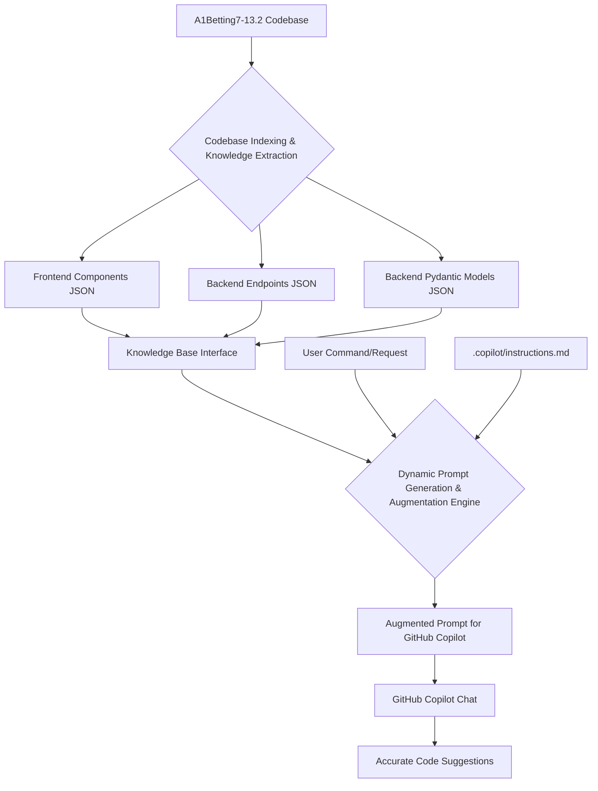

# Autonomous GitHub Copilot Guidance System for A1Betting7-13.2

This document details the design, implementation, and usage of an autonomous guidance system for GitHub Copilot, specifically tailored for the large and complex A1Betting7-13.2 codebase. The primary goal of this system is to minimize user intervention by dynamically providing highly contextualized prompts to Copilot, ensuring accurate and architecturally aligned code generation across the project's 3000+ files.

## 1. Introduction: The Challenge of Large Codebases and LLMs

Large software projects, like A1Betting7-13.2 with its extensive frontend (React/TypeScript) and backend (FastAPI/Python) components, present unique challenges for AI code assistants like GitHub Copilot. While powerful, LLMs often struggle with maintaining context across thousands of files, understanding intricate architectural patterns, and adhering to project-specific coding standards without explicit, continuous guidance. This system addresses these challenges by creating a persistent, queryable knowledge base of the codebase and using it to dynamically augment Copilot's prompts.

## 2. System Architecture Overview

The autonomous guidance system is composed of three main layers:

1.  **Codebase Indexing and Knowledge Extraction:** This layer systematically analyzes the entire A1Betting7-13.2 codebase to extract critical structural, functional, and relational information.
2.  **Knowledge Base Interface:** A programmatic interface that allows efficient querying and retrieval of the extracted codebase knowledge.
3.  **Dynamic Prompt Generation and Augmentation Engine:** This core engine leverages the knowledge base to dynamically construct and enrich prompts for GitHub Copilot based on user commands or natural language requests.



## 3. Codebase Indexing and Knowledge Extraction (Phase 2 Implementation)

This layer is responsible for building a comprehensive, machine-readable understanding of the A1Betting7-13.2 project. It involves static analysis of source code files to identify and categorize key entities and their relationships.

### 3.1. Extracted Information Categories

The system extracts the following crucial information:

-   **Frontend (React/TypeScript):**
    -   **Components:** Name, type (functional/class), props, and file path.
    -   **Data Models/Interfaces:** TypeScript interfaces and types used for data structures.
    -   **API Client Interactions:** Functions/methods making API calls, mapping to backend endpoints, and associated data structures.
-   **Backend (FastAPI/Python):**
    -   **API Endpoints:** Path, HTTP method (GET, POST, PUT, DELETE, PATCH), function name, and file path. (Future: parameters, response models).
    -   **Pydantic Models:** Name, fields (name, type), and file path.
    -   **Service Layer Logic:** Identification of service functions/classes.
    -   **ML Model Integration:** Identification of ML model loading and inference functions.

### 3.2. Tools and Scripts Used

-   **`file_scanner.py`:** A Python script that recursively scans the `frontend/src` and `backend/` directories to list all `.ts`, `.tsx`, and `.py` files. This list is saved to `scanned_files.json`.
-   **`ts_parser.mjs`:** A Node.js script utilizing `ts-morph` to parse TypeScript/React files. It identifies React components (functional and class-based) and extracts their names, types, props, and file paths. The output is saved to `frontend_components.json`.
-   **`py_parser.py`:** A Python script using the `ast` module to parse Python/FastAPI files. It identifies FastAPI endpoints (path, method, name) and Pydantic models (name, fields). The outputs are saved to `backend_endpoints.json` and `backend_pydantic_models.json` respectively.

### 3.3. Setup and Execution

To set up and run the indexing process:

1.  **Navigate to Tools Directory:** `cd /home/ubuntu/A1Betting7-13.2/tools/code_analyzer/`
2.  **Install Node.js Dependencies:** `npm install ts-morph` (if not already installed)
3.  **Run File Scanner:** `python3 file_scanner.py`
4.  **Run TypeScript Parser:** `node ts_parser.mjs`
5.  **Run Python Parser:** `python3 py_parser.py`

These scripts will generate the necessary JSON files (`frontend_components.json`, `backend_endpoints.json`, `backend_pydantic_models.json`) in the `tools/code_analyzer/` directory.

## 4. Knowledge Base Interface (Phase 2 Implementation)

The `knowledge_base_interface.py` script provides a Python class (`KnowledgeBase`) to easily load and query the JSON files generated by the indexing process. This interface abstracts away the file reading and parsing, allowing the dynamic prompt engine to efficiently retrieve specific pieces of information.

### 4.1. Key Features

-   **Lazy Loading:** Loads JSON data only when the `KnowledgeBase` object is instantiated.
-   **Query Methods:** Provides methods to search for frontend components, backend endpoints, and Pydantic models by name, path, or keyword.
-   **Error Handling:** Gracefully handles `FileNotFoundError` and `json.JSONDecodeError`.

### 4.2. Usage Example

```python
from knowledge_base_interface import KnowledgeBase

kb = KnowledgeBase()

# Get a specific frontend component
player_dashboard_component = kb.get_frontend_component("PlayerDashboard")

# Search for backend endpoints related to "user"
user_endpoints = kb.search_backend_endpoints("user")

# Get a specific Pydantic model
betting_recommendation_model = kb.get_pydantic_model("BettingRecommendation")
```

## 5. Dynamic Prompt Generation and Augmentation Engine (Phase 3 Implementation)

This is the core intelligence of the system, responsible for taking a high-level user command and transforming it into a rich, context-aware prompt for GitHub Copilot. It combines predefined prompt templates with dynamically retrieved information from the knowledge base and general project instructions.

### 5.1. Components

-   **`prompt_templates.py`:** Contains a dictionary (`PROMPT_TEMPLATES`) of parameterized prompt templates for common development tasks (e.g., `/playerdash`, `/aibetreco`). These templates include placeholders for dynamic content.
-   **`dynamic_prompt_generator.py`:** The main script that orchestrates the prompt generation process. It:
    -   Loads the `instructions.md` file for general project guidance.
    -   Uses the `KnowledgeBase` interface to fetch relevant codebase details based on the user's command.
    -   Fills the placeholders in the selected prompt template with the dynamic context.
    -   Augments the filled template with the general instructions from `instructions.md`.

### 5.2. Workflow

1.  **User Input:** The user initiates a task by typing a command (e.g., `/playerdash`) in GitHub Copilot Chat.
2.  **Command Mapping:** The `DynamicPromptGenerator` identifies the command and selects the corresponding template from `PROMPT_TEMPLATES`.
3.  **Context Retrieval:** Based on the command, the generator queries the `KnowledgeBase` for specific information (e.g., for `/playerdash`, it looks for player-related backend endpoints and frontend components).
4.  **Template Filling:** The retrieved information is used to populate the placeholders within the chosen prompt template.
5.  **Augmentation:** The content of `.copilot/instructions.md` is prepended to the dynamically generated prompt, ensuring Copilot always has the overarching architectural and coding standards in mind.
6.  **Final Prompt Output:** The complete, highly contextualized prompt is then presented to GitHub Copilot Chat, enabling it to generate more accurate and relevant code suggestions.

### 5.3. Example Usage (within the sandbox environment)

To test the dynamic prompt generation:

1.  Ensure all indexing scripts have been run successfully (Section 3.3).
2.  Navigate to the `tools/code_analyzer/` directory: `cd /home/ubuntu/A1Betting7-13.2/tools/code_analyzer/`
3.  Run the generator script: `python3 dynamic_prompt_generator.py`

This will print the generated prompts to the console, demonstrating how context is dynamically injected.

## 6. Integrating with GitHub Copilot in VS Code

While the current implementation generates the prompts, full integration for a seamless 

