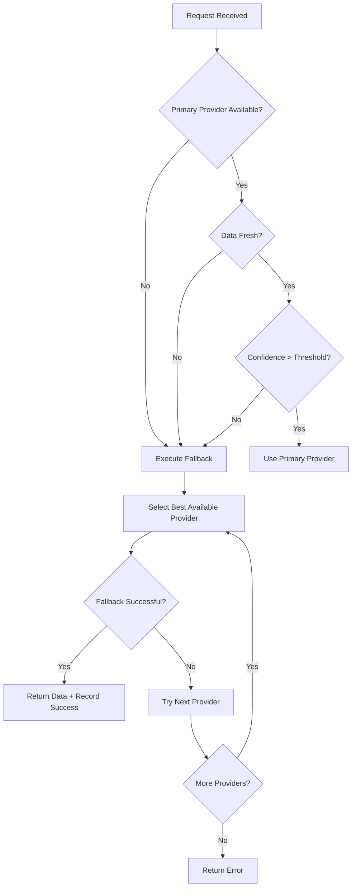

# Enhanced Odds Aggregation System Documentation

## Overview

The Enhanced Odds Aggregation System provides a robust, resilient infrastructure for aggregating sports betting odds from multiple providers with intelligent fallback mechanisms, comprehensive monitoring, and quality assurance features.

## Table of Contents

- [System Architecture](#system-architecture)
- [Core Components](#core-components)
- [Provider Confidence Scoring](#provider-confidence-scoring)
- [Smart Fallback Priority Logic](#smart-fallback-priority-logic)
- [Circuit Breaker Integration](#circuit-breaker-integration)
- [Schema Validation System](#schema-validation-system)
- [Prometheus Metrics](#prometheus-metrics)
- [API Reference](#api-reference)
- [Usage Examples](#usage-examples)
- [Configuration](#configuration)
- [Monitoring & Alerting](#monitoring--alerting)
- [Troubleshooting](#troubleshooting)

## System Architecture

The Enhanced Odds Aggregation System follows a layered architecture designed for high availability, performance, and maintainability:

```
┌─────────────────────────────────────────────────────────────┐
│                     API Layer                               │
├─────────────────────────────────────────────────────────────┤
│ • Provider Confidence API    • Smart Fallback API          │
│ • Schema Validation API      • Prometheus Metrics API      │
└─────────────────────────────────────────────────────────────┘
                                 │
┌─────────────────────────────────────────────────────────────┐
│                 Service Layer                               │
├─────────────────────────────────────────────────────────────┤
│ • ProviderConfidenceIntegration                             │
│ • SmartFallbackPriorityService                              │
│ • OddsAggregationMetrics                                    │
│ • EnhancedSchemaValidation                                  │
└─────────────────────────────────────────────────────────────┘
                                 │
┌─────────────────────────────────────────────────────────────┐
│               Integration Layer                             │
├─────────────────────────────────────────────────────────────┤
│ • ProviderResilienceManager  • EnhancedProviderStatistics  │
│ • TimeWindowStats           • CircuitBreakerState          │
└─────────────────────────────────────────────────────────────┘
                                 │
┌─────────────────────────────────────────────────────────────┐
│                 Data Layer                                  │
├─────────────────────────────────────────────────────────────┤
│ • DraftKings  • FanDuel  • BetMGM  • PointsBet • Others    │
└─────────────────────────────────────────────────────────────┘
```

### Key Design Principles

1. **Resilience First**: Automatic fallback mechanisms ensure continuous service availability
2. **Quality Assurance**: Comprehensive validation and confidence scoring maintain data integrity
3. **Observability**: Rich metrics and monitoring provide complete system visibility
4. **Performance**: Rolling window statistics and intelligent caching optimize response times
5. **Extensibility**: Modular design supports easy integration of new providers

## Core Components

### 1. Provider Confidence Integration

**Purpose**: Dynamically assess and score provider reliability based on historical performance.

**Key Features**:
- Real-time confidence scoring (0.0 - 1.0)
- Multi-dimensional quality assessment
- Automatic provider selection based on confidence levels
- Integration with circuit breaker states

**Location**: `backend/services/provider_confidence_integration.py`

### 2. Smart Fallback Priority Service

**Purpose**: Intelligent provider selection and fallback execution when primary sources fail.

**Key Features**:
- Automatic fallback on stale or failed primary data
- Priority-based provider ordering
- Comprehensive fallback analytics
- Concurrent operation support

**Location**: `backend/services/smart_fallback_priority_service.py`

### 3. Enhanced Schema Validation

**Purpose**: Validate incoming data quality with graduated severity levels.

**Key Features**:
- Comprehensive schema validation
- Warning system for non-critical issues
- Error categorization and severity levels
- Performance-optimized validation pipeline

**Location**: `backend/services/enhanced_schema_validation.py`

### 4. Prometheus Metrics System

**Purpose**: Comprehensive monitoring and observability for the entire aggregation system.

**Key Features**:
- Graceful degradation when Prometheus unavailable
- Provider performance metrics
- Circuit breaker state tracking
- Fallback execution analytics

**Location**: `backend/services/odds_aggregation_metrics.py`

## Provider Confidence Scoring

The provider confidence scoring system evaluates provider reliability across multiple dimensions:

### Confidence Calculation Algorithm

```python
confidence_score = (
    success_rate_weight * success_rate +
    latency_weight * normalized_latency_score +
    freshness_weight * data_freshness_score +
    circuit_weight * circuit_breaker_score
)
```

### Confidence Levels

| Level | Score Range | Description | Action |
|-------|-------------|-------------|--------|
| **HIGH** | 0.8 - 1.0 | Excellent reliability | Primary selection |
| **MEDIUM** | 0.6 - 0.79 | Good reliability | Secondary selection |
| **LOW** | 0.4 - 0.59 | Marginal reliability | Tertiary selection |
| **CRITICAL** | 0.0 - 0.39 | Poor reliability | Avoid unless necessary |

### Time Window Statistics

The system tracks performance across multiple time windows:

- **1 minute**: Real-time performance assessment
- **5 minutes**: Short-term trend analysis
- **15 minutes**: Medium-term reliability patterns
- **1 hour**: Long-term performance evaluation

### Usage Example

```python
from backend.services.provider_confidence_integration import ProviderConfidenceIntegration

confidence_service = ProviderConfidenceIntegration()

# Get provider confidence score
confidence = await confidence_service.get_provider_confidence("draftkings")
print(f"DraftKings confidence: {confidence}")  # Output: 0.85

# Get provider selection recommendation
selection = await confidence_service.select_best_provider(
    available_providers=["draftkings", "fanduel", "betmgm"],
    context="odds_aggregation"
)
print(f"Recommended provider: {selection.provider_id}")
```

## Smart Fallback Priority Logic

The Smart Fallback Priority Service provides intelligent provider selection and automatic fallback capabilities.

### Fallback Triggers

1. **Stale Data**: Primary provider data exceeds freshness threshold
2. **Circuit Breaker Open**: Provider circuit breaker in open state
3. **Low Confidence**: Provider confidence score below threshold
4. **Performance Degradation**: Response times exceed acceptable limits
5. **Manual Override**: Administrative fallback trigger

### Fallback Execution Flow



### Priority Calculation

Provider priority is calculated using:

```python
priority_score = (
    confidence_score * 0.4 +
    circuit_breaker_health * 0.3 +
    latency_performance * 0.2 +
    success_rate * 0.1
)
```

### Usage Example

```python
from backend.services.smart_fallback_priority_service import SmartFallbackPriorityService

fallback_service = SmartFallbackPriorityService()

# Set primary provider
await fallback_service.set_primary_provider("odds_aggregation", "draftkings")

# Execute operation with automatic fallback
result, provider, events = await fallback_service.execute_with_fallback(
    context="odds_aggregation",
    operation=fetch_odds_data,
    available_providers=["draftkings", "fanduel", "betmgm"]
)

print(f"Data retrieved from: {provider}")
print(f"Fallback events: {len(events)}")
```

## Circuit Breaker Integration

The system integrates with existing circuit breaker infrastructure to provide automatic failure detection and recovery.

### Circuit Breaker States

| State | Description | Provider Selection Impact |
|-------|-------------|---------------------------|
| **CLOSED** | Normal operation | Full priority in selection |
| **OPEN** | Failure threshold exceeded | Excluded from selection |
| **HALF_OPEN** | Testing recovery | Reduced priority |

### Circuit Breaker Metrics

- **Failure Rate**: Percentage of failed requests
- **Success Rate**: Percentage of successful requests  
- **Recovery Time**: Time to transition from OPEN to CLOSED
- **State Transitions**: Frequency of state changes

### Usage Example

```python
# Check circuit breaker state
provider_state = await resilience_manager.get_provider_state("draftkings")
print(f"Circuit breaker state: {provider_state.circuit_state}")

# Circuit breaker automatically affects provider selection
providers = await fallback_service.get_provider_priorities("odds_aggregation")
for provider in providers:
    print(f"{provider.provider_id}: {provider.circuit_state}")
```

## Schema Validation System

The Enhanced Schema Validation system provides comprehensive data quality assurance with graduated severity levels.

### Validation Categories

1. **Critical Errors**: Data corruption, type mismatches, required field violations
2. **Warnings**: Missing optional fields, format inconsistencies, deprecated fields
3. **Info**: Style recommendations, optimization suggestions

### Validation Pipeline

```python
# Example validation configuration
validation_config = SchemaValidationConfig(
    strict_mode=False,  # Allow warnings to pass
    fail_on_critical=True,
    collect_metrics=True,
    max_errors_per_request=10
)

# Validate odds data
validation_result = await schema_validator.validate_odds_response(
    data=odds_data,
    provider_id="draftkings",
    config=validation_config
)

if validation_result.is_valid:
    print("Data passed validation")
    if validation_result.warnings:
        print(f"Warnings: {len(validation_result.warnings)}")
else:
    print(f"Validation failed: {validation_result.errors}")
```

### Schema Validation Metrics

- **Validation Rate**: Requests validated per second
- **Error Rate**: Percentage of validation failures
- **Warning Rate**: Percentage of validation warnings
- **Performance**: Validation latency statistics

## Prometheus Metrics

The system provides comprehensive Prometheus metrics with proper guards for environments where Prometheus is not available.

### Key Metrics Categories

#### Provider Confidence Metrics
- `odds_aggregation_provider_confidence_score`: Current confidence score (0-1)
- `odds_aggregation_provider_confidence_trend`: Confidence changes over time

#### Circuit Breaker Metrics
- `odds_aggregation_circuit_breaker_state`: Current circuit breaker state
- `odds_aggregation_circuit_breaker_transitions_total`: State transition count
- `odds_aggregation_circuit_breaker_recovery_seconds`: Recovery time histogram

#### Fallback Execution Metrics
- `odds_aggregation_fallback_executions_total`: Total fallback executions
- `odds_aggregation_fallback_latency_seconds`: Fallback execution latency
- `odds_aggregation_active_fallback_contexts`: Active fallback contexts

#### Provider Performance Metrics
- `odds_aggregation_provider_requests_total`: Total provider requests
- `odds_aggregation_provider_latency_seconds`: Provider response latency
- `odds_aggregation_provider_success_rate`: Provider success rate by time window

#### Schema Validation Metrics
- `odds_aggregation_schema_validations_total`: Schema validation attempts
- `odds_aggregation_schema_validation_errors_total`: Validation errors by type

### Metrics Usage Example

```python
from backend.services.odds_aggregation_metrics import get_metrics

metrics = get_metrics()

# Record provider confidence
metrics.record_confidence_score("draftkings", "odds_aggregation", 0.85)

# Record fallback execution
metrics.record_fallback_execution(
    context="odds_aggregation",
    original_provider="draftkings",
    fallback_provider="fanduel",
    reason="stale_data",
    success=True,
    latency=0.125
)

# Check if metrics are enabled
if metrics.is_enabled():
    print("Prometheus metrics are active")
else:
    print("Metrics collection disabled - using mock implementations")
```

## API Reference

### Provider Confidence API

#### Get Provider Confidence
```http
GET /api/providers/confidence/{provider_id}
```

**Response**:
```json
{
  "provider_id": "draftkings",
  "confidence_score": 0.85,
  "confidence_level": "HIGH",
  "last_updated": "2024-01-15T10:30:00Z",
  "factors": {
    "success_rate": 0.95,
    "avg_latency_ms": 45.2,
    "data_freshness": 0.98,
    "circuit_state": "closed"
  }
}
```

#### Get Provider Selection
```http
POST /api/providers/confidence/select
```

**Request Body**:
```json
{
  "available_providers": ["draftkings", "fanduel", "betmgm"],
  "context": "odds_aggregation",
  "current_provider": "draftkings"
}
```

**Response**:
```json
{
  "selected_provider": "fanduel",
  "confidence_score": 0.82,
  "reason": "higher_confidence",
  "alternatives": [
    {
      "provider_id": "draftkings",
      "confidence_score": 0.78,
      "reason": "lower_confidence"
    }
  ]
}
```

### Smart Fallback API

#### Get Provider Priorities
```http
GET /api/smart-fallback/priorities/{context}
```

**Response**:
```json
{
  "context": "odds_aggregation",
  "primary_provider": "draftkings",
  "priorities": [
    {
      "provider_id": "draftkings",
      "priority_score": 0.85,
      "confidence_score": 0.82,
      "is_primary": true,
      "circuit_state": "closed",
      "estimated_latency_ms": 45.2
    }
  ]
}
```

#### Execute Fallback
```http
POST /api/smart-fallback/execute
```

**Request Body**:
```json
{
  "context": "odds_aggregation",
  "available_providers": ["draftkings", "fanduel", "betmgm"],
  "operation_config": {
    "timeout_seconds": 30,
    "max_retries": 3
  }
}
```

### Metrics API

#### Get Prometheus Metrics
```http
GET /metrics/prometheus
```

**Response**: Prometheus text format metrics

#### Get Metrics Health
```http
GET /metrics/health
```

**Response**:
```json
{
  "status": "healthy",
  "prometheus_client_available": true,
  "metrics_enabled": true,
  "registry_initialized": true,
  "description": "Metrics collection operational"
}
```

## Usage Examples

### Basic Provider Confidence Monitoring

```python
import asyncio
from backend.services.provider_confidence_integration import ProviderConfidenceIntegration

async def monitor_provider_confidence():
    confidence_service = ProviderConfidenceIntegration()
    
    providers = ["draftkings", "fanduel", "betmgm", "pointsbet"]
    
    for provider in providers:
        confidence = await confidence_service.get_provider_confidence(provider)
        level = await confidence_service.get_confidence_level(provider)
        
        print(f"{provider}: {confidence:.3f} ({level})")
        
        if confidence < 0.6:
            print(f"⚠️  {provider} has low confidence!")

# Run monitoring
asyncio.run(monitor_provider_confidence())
```

### Implementing Smart Fallback

```python
import asyncio
from backend.services.smart_fallback_priority_service import SmartFallbackPriorityService

async def fetch_odds_with_fallback():
    fallback_service = SmartFallbackPriorityService()
    
    # Configure primary provider
    await fallback_service.set_primary_provider("odds_aggregation", "draftkings")
    
    # Define odds fetching operation
    async def fetch_odds(provider_id: str) -> dict:
        # Your odds fetching logic here
        return await some_odds_api.fetch(provider_id)
    
    try:
        # Execute with automatic fallback
        result, provider, events = await fallback_service.execute_with_fallback(
            context="odds_aggregation",
            operation=fetch_odds,
            available_providers=["draftkings", "fanduel", "betmgm", "pointsbet"]
        )
        
        print(f"✅ Odds retrieved from {provider}")
        
        if events:
            print(f"🔄 {len(events)} fallback events occurred")
            for event in events:
                print(f"   {event.original_provider} → {event.fallback_provider} ({event.reason})")
        
        return result
        
    except Exception as e:
        print(f"❌ All providers failed: {e}")
        return None

# Execute odds fetching
asyncio.run(fetch_odds_with_fallback())
```

### Schema Validation Integration

```python
from backend.services.enhanced_schema_validation import EnhancedSchemaValidation

async def validate_odds_data():
    validator = EnhancedSchemaValidation()
    
    # Sample odds data
    odds_data = {
        "game_id": "12345",
        "provider": "draftkings",
        "odds": [
            {"market": "moneyline", "home": 150, "away": -120},
            {"market": "spread", "home": -3.5, "away": 3.5}
        ],
        "timestamp": "2024-01-15T10:30:00Z"
    }
    
    # Validate with warnings allowed
    result = await validator.validate_odds_response(
        data=odds_data,
        provider_id="draftkings",
        strict_mode=False
    )
    
    if result.is_valid:
        print("✅ Data validation passed")
        
        if result.warnings:
            print(f"⚠️  {len(result.warnings)} warnings:")
            for warning in result.warnings:
                print(f"   {warning.message}")
    else:
        print("❌ Data validation failed")
        for error in result.errors:
            print(f"   Error: {error.message}")
    
    return result

# Run validation
asyncio.run(validate_odds_data())
```

### Metrics Collection and Monitoring

```python
from backend.services.odds_aggregation_metrics import get_metrics

def setup_metrics_monitoring():
    metrics = get_metrics()
    
    # Check if metrics are available
    if not metrics.is_enabled():
        print("⚠️  Prometheus metrics not available")
        return
    
    print("✅ Metrics collection enabled")
    
    # Record some sample metrics
    metrics.record_confidence_score("draftkings", "odds_aggregation", 0.85)
    metrics.record_provider_request("draftkings", "success", 0.045)
    
    metrics.record_fallback_execution(
        context="odds_aggregation",
        original_provider="draftkings",
        fallback_provider="fanduel",
        reason="stale_data",
        success=True,
        latency=0.156
    )
    
    metrics.record_schema_validation(
        provider_id="draftkings",
        schema_type="odds_response",
        result="success"
    )
    
    print("📊 Metrics recorded successfully")

setup_metrics_monitoring()
```

## Configuration

### Environment Variables

```bash
# Provider Confidence Configuration
CONFIDENCE_SCORING_ENABLED=true
CONFIDENCE_UPDATE_INTERVAL=60
MIN_CONFIDENCE_THRESHOLD=0.6

# Smart Fallback Configuration
FALLBACK_ENABLED=true
FALLBACK_TIMEOUT_SECONDS=30
MAX_FALLBACK_ATTEMPTS=3

# Schema Validation Configuration
SCHEMA_VALIDATION_ENABLED=true
SCHEMA_STRICT_MODE=false
MAX_VALIDATION_ERRORS=10

# Metrics Configuration
PROMETHEUS_METRICS_ENABLED=true
METRICS_COLLECTION_INTERVAL=15

# Circuit Breaker Integration
CIRCUIT_BREAKER_ENABLED=true
FAILURE_THRESHOLD=5
RECOVERY_TIMEOUT=60
```

### Provider Configuration

```python
# Provider configuration example
PROVIDER_CONFIG = {
    "draftkings": {
        "weight": 1.0,
        "timeout": 5.0,
        "max_retries": 3,
        "circuit_breaker": {
            "failure_threshold": 5,
            "recovery_timeout": 60
        }
    },
    "fanduel": {
        "weight": 0.9,
        "timeout": 4.0,
        "max_retries": 2,
        "circuit_breaker": {
            "failure_threshold": 4,
            "recovery_timeout": 45
        }
    }
}
```

## Monitoring & Alerting

### Key Metrics to Monitor

1. **Provider Confidence Scores**
   - Alert if any provider drops below 0.5
   - Trend analysis for degrading confidence

2. **Fallback Execution Rate**
   - Alert if fallback rate > 20%
   - Monitor fallback success rate

3. **Circuit Breaker States**
   - Alert when circuit breakers open
   - Track recovery times

4. **Schema Validation Errors**
   - Alert on critical validation failures
   - Monitor warning trends

### Sample Prometheus Alerts

```yaml
groups:
  - name: odds_aggregation_alerts
    rules:
      - alert: ProviderConfidenceLow
        expr: odds_aggregation_provider_confidence_score < 0.5
        for: 5m
        labels:
          severity: warning
        annotations:
          summary: "Provider confidence is low"
          description: "Provider {{ $labels.provider_id }} confidence is {{ $value }}"

      - alert: HighFallbackRate
        expr: rate(odds_aggregation_fallback_executions_total[5m]) > 0.2
        for: 2m
        labels:
          severity: critical
        annotations:
          summary: "High fallback execution rate"
          description: "Fallback rate is {{ $value }} per second"

      - alert: CircuitBreakerOpen
        expr: odds_aggregation_circuit_breaker_state{state="open"} == 1
        for: 1m
        labels:
          severity: warning
        annotations:
          summary: "Circuit breaker is open"
          description: "Circuit breaker for {{ $labels.provider_id }} is open"
```

### Grafana Dashboard Queries

```promql
# Provider confidence trend
odds_aggregation_provider_confidence_score

# Fallback execution rate
rate(odds_aggregation_fallback_executions_total[5m])

# Provider latency percentiles
histogram_quantile(0.95, rate(odds_aggregation_provider_latency_seconds_bucket[5m]))

# Schema validation error rate
rate(odds_aggregation_schema_validation_errors_total[5m])

# Circuit breaker state distribution
count by (state) (odds_aggregation_circuit_breaker_state)
```

## Troubleshooting

### Common Issues and Solutions

#### 1. Low Provider Confidence Scores

**Symptoms**: Provider confidence consistently below 0.6

**Potential Causes**:
- High latency responses
- Frequent timeouts or errors
- Stale data from provider
- Circuit breaker frequently opening

**Solution Steps**:
1. Check provider performance metrics
2. Verify network connectivity
3. Review provider API status
4. Adjust timeout configurations
5. Contact provider support if needed

**Diagnostic Commands**:
```python
# Check provider performance
confidence = await confidence_service.get_provider_confidence("draftkings")
stats = await confidence_service.get_provider_statistics("draftkings")
print(f"Confidence: {confidence}, Success Rate: {stats.success_rate}")
```

#### 2. Excessive Fallback Executions

**Symptoms**: High fallback execution rate (>20%)

**Potential Causes**:
- Primary provider unreliable
- Overly aggressive confidence thresholds
- Network issues
- Configuration problems

**Solution Steps**:
1. Identify failing providers
2. Review confidence thresholds
3. Check network connectivity
4. Verify provider configurations
5. Consider adjusting primary provider

**Diagnostic Commands**:
```python
# Analyze fallback events
analytics = await fallback_service.get_fallback_analytics("odds_aggregation")
print(f"Fallback rate: {analytics.fallback_rate}")
print(f"Common reasons: {analytics.common_reasons}")
```

#### 3. Schema Validation Failures

**Symptoms**: High validation error rate

**Potential Causes**:
- Provider API changes
- Invalid data formats
- Missing required fields
- Outdated schemas

**Solution Steps**:
1. Review validation error details
2. Check for provider API changes
3. Update schema definitions
4. Adjust validation strictness
5. Contact provider for clarification

**Diagnostic Commands**:
```python
# Review validation errors
errors = await validator.get_recent_errors("draftkings")
for error in errors:
    print(f"Error: {error.message}, Field: {error.field}")
```

#### 4. Metrics Collection Issues

**Symptoms**: Missing or incomplete metrics

**Potential Causes**:
- Prometheus client not installed
- Metrics disabled in configuration
- Network connectivity issues
- Registry initialization problems

**Solution Steps**:
1. Check Prometheus client installation
2. Verify metrics configuration
3. Test metrics endpoints
4. Review error logs
5. Restart services if needed

**Diagnostic Commands**:
```bash
# Check metrics health
curl http://localhost:8000/metrics/health

# Verify Prometheus metrics
curl http://localhost:8000/metrics/prometheus
```

### Performance Optimization

#### 1. Confidence Score Calculation

- Use rolling windows appropriate for your use case
- Cache frequently accessed confidence scores
- Implement batch updates for multiple providers

#### 2. Fallback Execution

- Configure appropriate timeouts
- Limit concurrent fallback operations
- Use priority queues for provider selection

#### 3. Schema Validation

- Enable async validation for better performance
- Use schema caching to avoid repeated parsing
- Implement validation result caching

#### 4. Metrics Collection

- Adjust collection intervals based on needs
- Use appropriate metric types (Counter vs Gauge)
- Implement metric aggregation for high-volume scenarios

### Support and Maintenance

#### Regular Maintenance Tasks

1. **Weekly**:
   - Review provider confidence trends
   - Analyze fallback patterns
   - Check for schema validation issues

2. **Monthly**:
   - Update provider configurations
   - Review and tune thresholds
   - Analyze performance metrics

3. **Quarterly**:
   - Comprehensive system health review
   - Update documentation
   - Plan for new provider integrations

#### Getting Help

For additional support:

1. Check system logs for detailed error messages
2. Review Prometheus metrics for system health
3. Use diagnostic commands provided in this guide
4. Contact the development team with specific error details

---

*This documentation is maintained by the Enhanced Odds Aggregation development team. Last updated: January 2024*