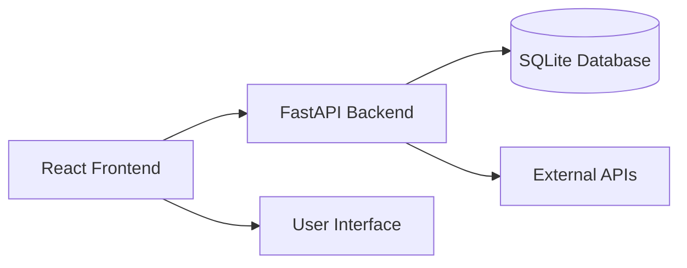

# PropOllama - AI-Powered Sports Analytics Platform

    

**Professional AI-Powered Sports Prop Research & Analytics Platform**

---

## 🚀 Current Status (January 2025)

**✅ FULLY FUNCTIONAL APPLICATION**

The PropOllama platform is now fully operational with:

- ✅ **PropOllama**: AI-powered sports prop analysis interface
- ✅ **Game Predictions**: Real-time AI game analysis and predictions
- ✅ **Modern UI**: Clean, responsive interface with cyber theme
- ✅ **Dev Server**: Running successfully on port 8174
- ✅ **No Build Errors**: All TypeScript and CSS issues resolved
- ✅ **User-Friendly Navigation**: Seamless switching between features

## 📑 Quick Start

### 1. Prerequisites

- Node.js 18+
- Python 3.8+
- Git

### 2. Installation

```bash
# Clone the repository
git clone https://github.com/itzcole03/A1Betting7-13.2.git
cd A1Betting7-13.2

# Install frontend dependencies
cd frontend && npm install

# Install backend dependencies
cd ../backend && pip install -r requirements.txt
```

### 3. Environment Setup

Create `.env` file in the `backend/` directory:

```env
SPORTRADAR_API_KEY=your_sportradar_key_here
ODDS_API_KEY=your_odds_api_key_here
```

### 4. Start the Application

**Backend:**

```bash
# From project root
python -m backend.main
# Backend runs on http://localhost:8000
```

**Frontend:**

```bash
# From frontend directory
cd frontend && npm run dev
# Frontend runs on http://localhost:8174
```

### 5. Access the App

Open your browser and navigate to: **http://localhost:8174**

## 🎯 Core Features

### PropOllama Interface

- **AI Prop Analysis**: Advanced AI-powered sports prop research
- **Real-time Data**: Live prop lines and recommendations
- **Multi-Sport Support**: NBA, NFL, NHL, MLB coverage
- **Bet Slip**: Interactive prop selection and lineup building
- **Confidence Scoring**: AI confidence ratings for each prop

### Game Predictions

- **AI Game Analysis**: Comprehensive game predictions across sports
- **Win Probabilities**: Team win percentage calculations
- **Betting Lines**: Real-time spread, over/under, and odds
- **Confidence Metrics**: AI confidence levels for predictions
- **Live Status**: Real-time game status updates

### Modern Interface

- **Responsive Design**: Works on desktop and mobile
- **Dark Theme**: Professional cyber-themed UI
- **Smooth Animations**: Framer Motion powered interactions
- **Error Handling**: Graceful error states and fallbacks
- **Loading States**: Skeleton loaders and progress indicators

## 🛠️ Technology Stack

### Frontend

- **React 18** with TypeScript
- **Vite** for development and bundling
- **Tailwind CSS** for styling
- **Framer Motion** for animations
- **Zustand** for state management
- **Lucide React** for icons

### Backend

- **FastAPI** with Python
- **SQLAlchemy** ORM
- **Pydantic** for validation
- **Async/Await** architecture
- **OpenTelemetry** monitoring

### Development

- **ESLint** + **Prettier** for code quality
- **Jest** for testing
- **TypeScript** for type safety
- **Hot Module Replacement** for fast development

## 📁 Project Structure

```
A1Betting7-13.2/
├── frontend/                 # React frontend application
│   ├── src/
│   │   ├── components/       # React components
│   │   │   ├── PropOllamaUnified.tsx    # Main prop analysis
│   │   │   ├── PredictionDisplay.tsx    # Game predictions
│   │   │   └── user-friendly/           # User interface components
│   │   ├── store/           # Zustand state management
│   │   ├── styles/          # CSS and styling
│   │   └── utils/           # Utility functions
│   ├── package.json         # Frontend dependencies
│   └── vite.config.ts       # Vite configuration
├── backend/                  # Python FastAPI backend
│   ├── routes/              # API route handlers
│   ├── services/            # Business logic services
│   ├── models/              # Database models
│   └── main.py              # Application entry point
└── README.md                # This file
```

## 🔧 Development

### Frontend Development

```bash
cd frontend
npm run dev          # Start development server
npm run build        # Build for production
npm run test         # Run tests
npm run lint         # Run ESLint
```

### Backend Development

```bash
cd backend
python main.py       # Start development server
pytest              # Run tests
```

### Code Quality

- **TypeScript**: Strict type checking enabled
- **ESLint**: Consistent code style
- **Prettier**: Automatic code formatting
- **Git Hooks**: Pre-commit quality checks

## 🏗️ Architecture

The application follows a modern full-stack architecture:

## 📊 Monitoring & Alerting (Business Rules)

- All business rule violations are logged with granular reasons and bet IDs.
- Log aggregation is recommended (e.g., ELK, Loki, or cloud logging) to track violation counts and trends over time.
- Alerting should be configured if all bets in a batch are filtered (possible config error or ruleset issue).
- (Optional) Add a dashboard widget to visualize top violation reasons and trends for admins.

## 🚦 Performance Observability & Future Optimization

- Current business rules enforcement is performant for the present scale.
- If forbidden combos or stat types grow significantly, batch or set-based optimizations should be implemented.
- TODO: In the main analysis loop, consider set-based lookups and vectorized checks for large rulesets.

---



### Key Components

1. **PropOllamaUnified**: Main prop analysis interface with AI-powered recommendations
2. **PredictionDisplay**: Game prediction dashboard with real-time analytics
3. **UserFriendlyApp**: Main application shell with navigation
4. **State Management**: Centralized Zustand stores for app, betting, and prediction state
5. **API Services**: Unified API service layer with error handling and fallbacks

## 🚦 Current Status Details

### ✅ Working Features

- **Frontend Server**: Running on port 8174 with no errors
- **Component Loading**: PropOllama and Predictions components fully functional
- **Navigation**: Smooth transitions between different views
- **UI/UX**: Professional interface with animations and responsive design
- **State Management**: Functional state management across components
- **Error Handling**: Proper error boundaries and fallback states

### 🔧 Recent Fixes (January 2025)

- **Fixed Proxy Configuration**: Corrected dev server port mapping
- **Resolved TypeScript Errors**: Fixed all compilation issues
- **Created Missing CSS Files**: Added all required style imports
- **Removed Corrupted Files**: Cleaned up broken/unused components
- **Updated Dependencies**: Proper package management and imports

### 📋 Testing Status

- **Component Tests**: Available for core components
- **Integration Tests**: Backend API integration tests
- **E2E Tests**: Frontend user flow testing
- **Performance**: Optimized loading and rendering

## 🎨 User Interface

The PropOllama interface features:

### Design System

- **Color Palette**: Professional dark theme with purple/blue gradients
- **Typography**: Clean, readable fonts with proper hierarchy
- **Spacing**: Consistent spacing and layout patterns
- **Icons**: Lucide React icon system
- **Animations**: Smooth Framer Motion transitions

### Responsive Design

- **Mobile First**: Optimized for mobile devices
- **Desktop Enhanced**: Rich desktop experience
- **Adaptive Layout**: Responsive grid and flexbox layouts
- **Touch Friendly**: Large touch targets and gestures

## 🔮 Future Roadmap

### Short Term

- [ ] Backend API integration for live data
- [ ] User authentication and profiles
- [ ] Enhanced AI model integration
- [ ] Real-time WebSocket updates

### Medium Term

- [ ] Mobile app development
- [ ] Advanced analytics dashboard
- [ ] Social features and sharing
- [ ] Performance optimizations

### Long Term

- [ ] Machine learning model training
- [ ] Multi-language support
- [ ] Enterprise features
- [ ] API monetization

## 🤝 Contributing

1. **Fork** the repository
2. **Create** a feature branch (`git checkout -b feature/amazing-feature`)
3. **Commit** your changes (`git commit -m 'Add amazing feature'`)
4. **Push** to the branch (`git push origin feature/amazing-feature`)
5. **Open** a Pull Request

### Development Guidelines

- Follow existing code style and conventions
- Write tests for new features
- Update documentation as needed
- Ensure all checks pass before submitting

## 📞 Support

### Getting Help

- **Issues**: Create GitHub issues for bugs and feature requests
- **Discussions**: Use GitHub discussions for questions
- **Documentation**: Check existing docs and README files

### Troubleshooting

- **Port Conflicts**: Dev server will auto-select available ports
- **Dependencies**: Run `npm install` and `pip install -r requirements.txt`
- **Environment**: Ensure `.env` file is properly configured
- **Browser**: Clear cache and refresh if needed

## 📄 License

This project is licensed under the MIT License - see the [LICENSE](LICENSE) file for details.

## 🙏 Acknowledgments

- **React Team** for the amazing framework
- **Vite Team** for lightning-fast development
- **Tailwind CSS** for utility-first styling
- **FastAPI** for the powerful backend framework
- **Open Source Community** for countless contributions

---

**Built with ❤️ by the PropOllama Team**

_Last Updated: January 2025_
