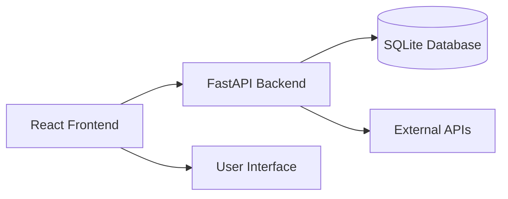

# A1Betting7-13.2 - AI-Powered Sports Analytics Platform

    

**A comprehensive AI-powered platform for sports prop research and analytics, currently under active development and refinement.**

---

> **CI reliability and test environment compatibility are top priorities for stabilization and ongoing development. See the roadmap for open issues and checklist.**

---

## 🏎️ Recent Frontend Performance & Type Safety Improvements (August 2025)

**React Render Optimization & Type Safety**

- All major prop analytics components (`PropOllamaContainer.tsx`, `PropList.tsx`, and subcomponents) have been refactored for minimal re-renders using `React.memo`, `useCallback`, and `useMemo`.
- TypeScript type errors in these files are fully resolved; all handler and prop signatures are now type-safe and aligned with the `FeaturedProp` interface.
- Large prop datasets are now virtualized with `VirtualizedPropList` for optimal browser performance.
- The frontend type check and test suite confirm that these changes introduce no regressions or new errors in the optimized files.

**Test & Type Check Results**

- Type check: No errors in `PropOllamaContainer.tsx` or `PropList.tsx`.
- Test suite: No failures related to these files. Most failures are due to API URL parsing and test data/DOM structure in unrelated tests.

**Known Issues & Next Steps**

- Some test failures remain in API compatibility and DOM structure for unrelated components; these do not affect the optimized prop analytics flow.
- Next recommended targets: further optimize state management in `usePropOllamaState`, address API URL handling in test mocks, and expand virtualization to additional large lists if needed.

_For details, see the code in `frontend/src/components/containers/PropOllamaContainer.tsx`, `frontend/src/components/lists/PropList.tsx`, and related files._

## 🚀 Current Status (August 2025)

The A1Betting7-13.2 platform is under active development, focusing on resolving critical frontend stability issues and integrating advanced features to merge the capabilities of PropGPT (AI predictions) and PropFinder (comprehensive research tools).

### ✅ Backend Status:

- **Fully Functional:** The FastAPI backend is robust and actively processing data, generating player and team props, and serving API requests successfully (e.g., `/mlb/odds-comparison/` returns 200 OK).
- **Sophisticated Data Pipeline:** Includes advanced data ingestion, processing, and AI/ML components (`enhanced_propollama_engine.py`, `prediction_engine.py`).

### ⚠️ Frontend Status (Under Active Debugging):

- **Persistent Loading/Refreshing Loop:** The primary symptom is a continuous re-rendering cycle, preventing stable display.
- **"Backend version mismatch" Warning:** A critical warning (`[APP] Backend version mismatch - Possible resolution conflict`) is frequently observed, likely triggering the refresh loop.
- **Unstable WebSocket Connection:** Initial WebSocket connection failures (`WebSocket is closed before the connection is established.`) persist, even if a connection is eventually made, disrupting real-time data flow.
- **Incomplete Data Display:** Despite the backend successfully serving data, the frontend is not consistently or correctly displaying it, indicating issues with data consumption and state management.

## 📑 Quick Start

### 1. Prerequisites

- Node.js 18+
- Python 3.8+
- Git

### 2. Installation

```bash
# Clone the repository
git clone https://github.com/itzcole03/A1Betting7-13.2.git
cd A1Betting7-13.2

# Install frontend dependencies
cd frontend && npm install

# Install backend dependencies
cd ../backend && pip install -r requirements.txt
```

### 3. Environment Setup

Create `.env` file in the `backend/` directory:

```env
SPORTRADAR_API_KEY=your_sportradar_key_here
ODDS_API_KEY=your_odds_api_key_here
```

### 4. Start the Application

**Backend:**

```bash
# From project root
python -m backend.main
# Backend runs on http://localhost:8000
```

**Frontend:**

```bash
# From frontend directory
cd frontend && npm run dev
# Frontend runs on http://localhost:5173 (or similar, check console)
```

### 5. Access the App

Open your browser and navigate to: **http://localhost:5173** (or the port indicated in your frontend console)

## 🎯 Core Features (Planned & In Progress)

### PropGPT - AI-Powered Insights

- **AI Prop Analysis**: Advanced AI-powered sports prop research and predictions.
- **Confidence Scoring**: AI confidence ratings for each prop.
- **Game Predictions**: Real-time AI game analysis and predictions.
- **Real-time Data**: Live prop lines and recommendations.

### PropFinder - Comprehensive Research Tools

- **Player Dashboard**: Detailed player performance trends, matchup analysis, advanced stats, and opponent-specific game logs.
- **Quick Glance Stats**: Efficient display of relevant prop stats.
- **Comprehensive Data Access**: Democratizing access to advanced sports betting data and tools.
- **Personalized Alerts & Notifications**: Engagement features for bet updates.
- **Search Functionality**: Ability to search for prop markets by player or team.
- **Multi-Sport Support**: Covering various sports like MLB, NBA, NFL, NHL, WNBA.
- **Interactive Visualizations**: Charts and graphs for data presentation.

### Modern Interface

- **Responsive Design**: Works on desktop and mobile.
- **Dark Theme**: Professional cyber-themed UI.
- **Smooth Animations**: Framer Motion powered interactions.
- **Error Handling**: Graceful error states and fallbacks.
- **Loading States**: Skeleton loaders and progress indicators.

## 🛠️ Technology Stack

### Frontend

- **React 18** with TypeScript
- **Vite** for development and bundling
- **Tailwind CSS** for styling
- **Framer Motion** for animations
- **Zustand** for state management
- **Lucide React** for icons

### Backend

- **FastAPI** with Python
- **SQLAlchemy** ORM
- **Pydantic** for validation
- **Async/Await** architecture
- **OpenTelemetry** monitoring

### Development

- **ESLint** + **Prettier** for code quality
- **Jest** for testing
- **TypeScript** for type safety
- **Hot Module Replacement** for fast development

## 📁 Project Structure

```
A1Betting7-13.2/
├── frontend/                 # React frontend application
│   ├── src/
│   │   ├── components/       # React components
│   │   │   ├── PropOllamaUnified.tsx    # Main prop analysis
│   │   │   ├── PredictionDisplay.tsx    # Game predictions
│   │   │   └── user-friendly/           # User interface components
│   │   ├── store/           # Zustand state management
│   │   ├── styles/          # CSS and styling
│   │   └── utils/           # Utility functions
│   ├── package.json         # Frontend dependencies
│   └── vite.config.ts       # Vite configuration
├── backend/                  # Python FastAPI backend
│   ├── routes/              # API route handlers
│   ├── services/            # Business logic services
│   ├── models/              # Database models
│   └── main.py              # Application entry point
└── README.md                # This file
```

## 🔧 Development

### Frontend Development

```bash
cd frontend
npm run dev          # Start development server
npm run build        # Build for production
npm run test         # Run tests
npm run lint         # Run ESLint
```

### Backend Development

```bash
cd backend
python main.py       # Start development server
pytest              # Run tests
```

### Code Quality

- **TypeScript**: Strict type checking enabled
- **ESLint**: Consistent code style
- **Prettier**: Automatic code formatting
- **Git Hooks**: Pre-commit quality checks

## 🏗️ Architecture

The application follows a modern full-stack architecture:



### Key Components

1.  **PropOllamaUnified**: Main prop analysis interface with AI-powered recommendations
2.  **PredictionDisplay**: Game prediction dashboard with real-time analytics
3.  **UserFriendlyApp**: Main application shell with navigation
4.  **State Management**: Centralized Zustand stores for app, betting, and prediction state
5.  **API Services**: Unified API service layer with error handling and fallbacks

## 📊 Monitoring & Alerting (Business Rules)

- All business rule violations are logged with granular reasons and bet IDs.
- Log aggregation is recommended (e.g., ELK, Loki, or cloud logging) to track violation counts and trends over time.
- Alerting should be configured if all bets in a batch are filtered (possible config error or ruleset issue).
- (Optional) Add a dashboard widget to visualize top violation reasons and trends for admins.

## 🚦 Performance Observability & Future Optimization

- Current business rules enforcement is performant for the present scale.
- If forbidden combos or stat types grow significantly, batch or set-based optimizations should be implemented.
- TODO: In the main analysis loop, consider set-based lookups and vectorized checks for large rulesets.

## 🔮 Future Roadmap

This roadmap outlines the phased approach to stabilize the application and integrate advanced features, merging the best aspects of PropGPT and PropFinder.

### Phase 1: Application Stabilization (Immediate Priority)

**Goal:** Eliminate the frontend loading/refreshing loop and establish stable communication between frontend and backend.

- **Resolve "Backend version mismatch":** Identify and correct the versioning logic in the frontend to match the backend API version (currently `2.0.0`). Implement graceful handling for any future mismatches to prevent continuous reloads.
- **Stabilize WebSocket Connections:** Enhance `WebSocketContext.tsx` with robust error handling, exponential backoff for reconnection attempts, and proper lifecycle management to ensure stable real-time communication.
- **Verify Initial Data Fetching:** Ensure the `usePropOllamaData` hook reliably triggers API calls (e.g., `/mlb/todays-games`, `/api/v2/sports/activate`) and correctly processes their responses, updating the frontend state without issues.
- **Identify & Break Re-render Loops:** Use React Developer Tools to pinpoint and eliminate excessive re-renders in `UserFriendlyApp` and `PropOllamaContainer` through strategic memoization (`React.memo`, `useCallback`, `useMemo`).

### Phase 2: Core Feature Implementation & Refinement (PropFinder Aspect)

**Goal:** Build out the core data presentation and interaction features that define a comprehensive sports data research tool.

- **Develop a Robust Player Dashboard:** Create a centralized view for player-specific data, including key stats, performance trends, matchup analysis, and advanced metrics, with interactive charts and graphs.
- **Implement Comprehensive Search and Filtering:** Add a global search bar and advanced filtering options (sport, league, date, market type, stats, odds ranges) with dynamic loading for large datasets.
- **Interactive Visualizations:** Integrate charting libraries to visualize player trends, head-to-head matchups, and historical performance, allowing for comparison tools.
- **Real-time Data Display:** Leverage stable WebSockets to push live odds, game scores, and player status updates to the frontend with visual cues.

### Phase 3: AI Prediction Integration & Enhancement (PropGPT Aspect)

**Goal:** Seamlessly integrate AI-driven predictions and insights into the user interface, making them actionable and understandable.

- **Display AI Predictions Prominently:** Show AI-generated predictions (e.g., over/under probabilities, predicted stat lines) with confidence scores and brief explanations/rationales.
- **Interactive Prediction Filters:** Allow users to filter predictions based on sport, confidence level, prop type, or specific AI model.
- **Feedback Loop for AI:** Implement a mechanism for user feedback on predictions to refine AI models.
- **Integration with Research Tools:** Ensure seamless transition from AI predictions to detailed research views for validation.

### Phase 4: Refinement, Performance, and Scalability

**Goal:** Optimize the application for speed, reliability, and maintainability, ensuring a smooth user experience and future growth.

- **Performance Optimization:** Profile and optimize both frontend and backend for faster response times, efficient data handling, and reduced re-renders.
- **Robust Error Handling and User Feedback:** Implement comprehensive error boundaries and user-friendly messages across the application, with centralized logging.
- **Security Enhancements:** Strengthen API authentication/authorization, implement rate limiting, and ensure data privacy.
- **Automated Testing:** Expand unit, integration, and end-to-end test coverage, integrating tests into CI/CD.
- **Documentation and Code Quality:** Maintain up-to-date documentation and ensure high code quality through regular code reviews.

## 🤝 Contributing

1.  **Fork** the repository
2.  **Create** a feature branch (`git checkout -b feature/amazing-feature`)
3.  **Commit** your changes (`git commit -m 'Add amazing feature'`)
4.  **Push** to the branch (`git push origin feature/amazing-feature`)
5.  **Open** a Pull Request

### Development Guidelines

- Follow existing code style and conventions
- Write tests for new features
- Update documentation as needed
- Ensure all checks pass before submitting

## 📞 Support

### Getting Help

- **Issues**: Create GitHub issues for bugs and feature requests
- **Discussions**: Use GitHub discussions for questions
- **Documentation**: Check existing docs and README files

### Troubleshooting

- **Frontend Loading Loop**: Refer to Phase 1 of the Future Roadmap for detailed debugging steps, focusing on version mismatch and WebSocket stability.
- **Empty MLB Table**: If the MLB props/AI insights table is empty, check backend logs for errors. A missing `alert_event` method in `MLBProviderClient` will break fallback logic and cause empty responses. Ensure this method exists and Redis is running.
- **Port Conflicts**: Dev server will auto-select available ports.
- **Dependencies**: Run `npm install` and `pip install -r requirements.txt`.
- **Environment**: Ensure `.env` file is properly configured.
- **Browser**: Clear cache and refresh if needed.

## 📄 License

This project is licensed under the MIT License - see the [LICENSE](LICENSE) file for details.

## 🙏 Acknowledgments

- **React Team** for the amazing framework
- **Vite Team** for lightning-fast development
- **Tailwind CSS** for utility-first styling
- **FastAPI** for the powerful backend framework
- **Open Source Community** for countless contributions

---

**Built with ❤️ by the PropOllama Team**

_Last Updated: August 2025_
