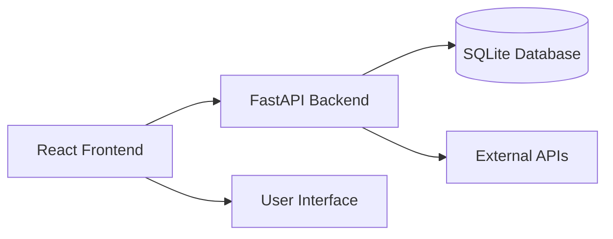

# Architecture Assessment and Technology Stack Analysis

## Current Application Architecture

The A1Betting7-13.2 application currently operates on a modern full-stack architecture, primarily composed of a React frontend and a FastAPI backend. This architecture is designed to support an AI-powered sports analytics platform, integrating various data sources and machine learning components. The core components and their interactions can be visualized as follows:

### Key Architectural Components:

1.  **React Frontend:** This serves as the user interface, responsible for displaying data, handling user interactions, and visualizing insights. It is built with React 18 and TypeScript, utilizing Vite for development and bundling, Tailwind CSS for styling, Framer Motion for animations, Zustand for state management, and Lucide React for icons.

2.  **FastAPI Backend:** Developed with Python, the backend is the central hub for data processing, business logic, and API serving. It interacts with various data sources, including external APIs and an internal SQLite database. Key technologies include SQLAlchemy ORM for database interactions, Pydantic for data validation, and an asynchronous architecture for handling requests efficiently. The backend also incorporates advanced AI/ML components, such as `enhanced_propollama_engine.py` and `prediction_engine.py`.

3.  **SQLite Database:** This serves as the primary data persistence layer for the application. It stores various types of data, including historical information, user data, and potentially processed analytical results. The `alembic` directory indicates the use of database migrations for schema management.

4.  **External APIs:** The application relies on external data sources for real-time sports data, odds, and other relevant information. The `README.md` mentions `SPORTRADAR_API_KEY` and `ODDS_API_KEY`, indicating integration with Sportradar and other odds providers.

5.  **User Interface:** The frontend components collectively form the user interface, providing features like AI prop analysis, game predictions, player dashboards, and comprehensive search functionalities.

### Data Flow and Interactions:

-   **User to Frontend:** Users interact with the application through the React frontend, initiating requests for data or analysis.
-   **Frontend to Backend (API):** The frontend communicates with the FastAPI backend via RESTful API calls and WebSocket connections for real-time data. The `README.md` specifically highlights issues with WebSocket stability and a 

backend version mismatch" warning, indicating that this communication channel is a critical area of concern.
-   **Backend to Database:** The backend interacts with the SQLite database to store and retrieve data, using SQLAlchemy as the ORM.
-   **Backend to External APIs:** The backend fetches data from external sports data providers to enrich its own data and provide real-time insights.

## Technology Stack

The application employs a modern and comprehensive technology stack, tailored for a data-intensive, real-time analytics platform. The stack can be broken down into the following categories:

### Frontend

-   **Framework:** React 18 with TypeScript
-   **Build Tool:** Vite
-   **Styling:** Tailwind CSS
-   **Animations:** Framer Motion
-   **State Management:** Zustand
-   **Icons:** Lucide React

### Backend

-   **Framework:** FastAPI with Python
-   **ORM:** SQLAlchemy
-   **Data Validation:** Pydantic
-   **Asynchronous Architecture:** Async/Await
-   **Monitoring:** OpenTelemetry

### Development

-   **Code Quality:** ESLint + Prettier
-   **Testing:** Jest (frontend), Pytest (backend)
-   **Type Safety:** TypeScript
-   **Development Server:** Hot Module Replacement (HMR)

## Architectural Patterns and Anti-Patterns

### Identified Architectural Patterns:

-   **Microservices-like Architecture (Backend):** The backend is structured into a large number of services and routes, which could be seen as an attempt at a microservices-like architecture. This modular approach can be beneficial for separating concerns and enabling independent development and deployment of different functionalities.
-   **Layered Architecture:** The backend code is organized into layers, including routes, services, and models. This separation of concerns is a good practice that can improve maintainability and testability.
-   **Asynchronous Processing:** The use of an async/await architecture in the backend is well-suited for a data-intensive application that needs to handle a large number of I/O-bound operations, such as fetching data from external APIs.

### Identified Architectural Anti-Patterns:

-   **Monolithic Frontend:** While the backend shows signs of a microservices-like approach, the frontend appears to be a single, monolithic application. This can lead to challenges in terms of scalability, maintainability, and team collaboration as the application grows in complexity.
-   **God Objects/Services:** The presence of files like `comprehensive_prop_generator.py` and `unified_api.py` suggests the existence of "God objects" or services that have too many responsibilities. This can lead to tightly coupled code that is difficult to understand, test, and maintain.
-   **Configuration Sprawl:** Configuration files are scattered throughout the repository, which is a common anti-pattern that can lead to inconsistencies and make it difficult to manage the application's configuration.
-   **Inconsistent Naming and Organization:** The repository suffers from inconsistent naming conventions and a lack of clear organization, which can make it difficult for developers to navigate the codebase and understand the purpose of different files and directories.

## Integration Assessment

The integration between the frontend and backend is a critical aspect of the application's functionality and appears to be a major source of issues. The `README.md` file explicitly mentions a "persistent loading/refreshing loop" on the frontend, which is attributed to a "backend version mismatch" warning and unstable WebSocket connections.

### Key Integration Points:

-   **RESTful API:** The primary method of communication between the frontend and backend is through a RESTful API. The backend exposes a wide range of endpoints for fetching data, submitting requests, and performing other actions.
-   **WebSockets:** WebSockets are used for real-time data communication, such as pushing live odds and game updates to the frontend. The instability of the WebSocket connection is a major concern that needs to be addressed.

### Integration Challenges:

-   **Versioning:** The "backend version mismatch" warning indicates a lack of a clear and robust versioning strategy for the API. This can lead to compatibility issues between the frontend and backend, especially when new features are introduced or changes are made to the API.
-   **Error Handling:** The `README.md` mentions the need for "graceful handling for any future mismatches to prevent continuous reloads." This suggests that the current error handling mechanisms are not sufficient to handle integration issues gracefully.
-   **Testing:** The presence of numerous integration test files suggests that the integration is a complex and potentially fragile area. A comprehensive and automated integration testing strategy is needed to ensure the stability and reliability of the application.

