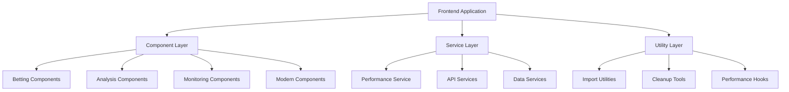

# A1Betting Documentation Index

## 📚 Complete Documentation Hub

This index provides a comprehensive overview of all documentation, guides, and resources for the A1Betting frontend application.

---

## 🚀 Quick Start Guides

### For Developers
1. **[CHANGELOG.md](./CHANGELOG.md)** - Latest changes and version history
2. **[FEATURE_DOCUMENTATION.md](./FEATURE_DOCUMENTATION.md)** - Complete feature overview
3. **[BETTING_COMPONENT_STANDARDS.md](./BETTING_COMPONENT_STANDARDS.md)** - Coding standards
4. **[README.md](./README.md)** - Getting started guide

### For Component Development
1. **[ULTIMATE_MONEY_MAKER_DOCS.md](./ULTIMATE_MONEY_MAKER_DOCS.md)** - Ultimate Money Maker guide
2. **[Component TypeScript Definitions](./src/components/MoneyMaker/types.d.ts)** - Type definitions
3. **[Performance Optimization Service](./src/services/performance/)** - Optimization tools
4. **[Import Refactoring Utilities](./src/utils/refactorImports.ts)** - Code quality tools

---

## 📋 Documentation Categories

### 🏗️ Architecture & Design

| Document | Description | Status |
|----------|-------------|---------|
| [ARCHITECTURE.md](./ARCHITECTURE.md) | System architecture overview | ✅ Complete |
| [FEATURE_DOCUMENTATION.md](./FEATURE_DOCUMENTATION.md) | Comprehensive feature guide | ✅ Complete |
| [BETTING_COMPONENT_STANDARDS.md](./BETTING_COMPONENT_STANDARDS.md) | Component coding standards | ✅ Complete |
| [DEPENDENCY_GRAPH.md](./DEPENDENCY_GRAPH.md) | Dependency relationships | ✅ Complete |

### 🎯 Component Documentation

| Component | Documentation | API Reference | Status |
|-----------|---------------|---------------|---------|
| **Ultimate Money Maker** | [ULTIMATE_MONEY_MAKER_DOCS.md](./ULTIMATE_MONEY_MAKER_DOCS.md) | [types.d.ts](./src/components/MoneyMaker/types.d.ts) | ✅ Complete |
| **PropFinder Killer** | [Component README](./src/components/modern/README.md) | [Component Code](./src/components/modern/OptimizedPropFinderKillerDashboard.tsx) | ✅ Complete |
| **Matchup Analysis** | [Component Code](./src/components/analysis/AdvancedMatchupAnalysisTools.tsx) | Inline Documentation | ✅ Complete |
| **Monitoring Dashboard** | [Component Code](./src/components/monitoring/ComprehensiveMonitoringDashboard.tsx) | Inline Documentation | ✅ Complete |

### 🔧 Development Guides

| Guide | Purpose | Target Audience |
|-------|---------|-----------------|
| [CONTRIBUTING.md](./CONTRIBUTING.md) | Contribution guidelines | All Developers |
| [TEST_COVERAGE.md](./TEST_COVERAGE.md) | Testing strategies | QA & Developers |
| [PERFORMANCE_MONITORING.md](./PERFORMANCE_MONITORING.md) | Performance optimization | Senior Developers |
| [SECURITY_CHECKLIST.md](./SECURITY_CHECKLIST.md) | Security best practices | Security Team |

### 📊 Project Management

| Document | Purpose | Audience |
|----------|---------|----------|
| [CHANGELOG.md](./CHANGELOG.md) | Version history and changes | All Team Members |
| [ROADMAP.md](./ROADMAP.md) | Future development plans | Product Team |
| [PROJECT_STATUS.md](./PROJECT_STATUS.md) | Current project status | Management |
| [FEATURE_ENHANCEMENT_PLAN.md](./FEATURE_ENHANCEMENT_PLAN.md) | Enhancement roadmap | Product Team |

---

## 🎯 Feature-Specific Documentation

### Ultimate Money Maker Suite

#### Core Documentation
- **[Comprehensive Guide](./ULTIMATE_MONEY_MAKER_DOCS.md)** - 200+ lines covering architecture, API, usage
- **[Component README](./src/components/MoneyMaker/README.md)** - Quick start and component-specific docs
- **[TypeScript Definitions](./src/components/MoneyMaker/types.d.ts)** - Complete type definitions

#### Technical Deep Dives
- **Quantum AI Engine** - Superposition, entanglement, interference documentation
- **ML Model Ensemble** - XGBoost, Neural Networks, LSTM, Random Forest integration
- **Risk Management** - Kelly Criterion, portfolio optimization, risk metrics
- **Performance Optimization** - React 19 features, memoization, virtualization

### PropFinder Killer Dashboard

#### Implementation Details
- **[Enhanced Component](./src/components/modern/EnhancedPropFinderKillerDashboard.tsx)** - Original implementation
- **[Optimized Component](./src/components/modern/OptimizedPropFinderKillerDashboard.tsx)** - Performance-optimized version
- **[Performance Service](./src/services/performance/PerformanceOptimizationService.ts)** - Optimization utilities

#### Features Covered
- Multi-source data integration (5+ APIs)
- AI model ensemble with dynamic weighting
- Real-time market monitoring and analysis
- Advanced filtering and search capabilities
- Virtual scrolling for large datasets

### Advanced Matchup Analysis

#### Components
- **[Advanced Tools](./src/components/analysis/AdvancedMatchupAnalysisTools.tsx)** - Statistical modeling suite
- **[Standard Tools](./src/components/analysis/MatchupAnalysisTools.tsx)** - Basic analysis tools

#### Analysis Types
- Head-to-head historical comparison
- Bayesian analysis with prior updating
- Regression modeling (linear, polynomial, logistic)
- Correlation matrix visualization
- Predictive insights with confidence intervals

### Comprehensive Monitoring

#### Dashboard Features
- **[Monitoring Component](./src/components/monitoring/ComprehensiveMonitoringDashboard.tsx)** - Real-time monitoring
- Data pipeline health tracking
- ML model performance monitoring
- System health metrics and alerting
- Performance analytics and reporting

---

## 🏗️ Architecture Documentation

### System Overview



### Component Hierarchy

```
Frontend Architecture:
├── components/
│   ├── betting/           # Standardized betting components
│   │   ├── core/         # Basic functionality
│   │   ├── advanced/     # AI-enhanced features
│   │   ├── types.ts      # Type definitions
│   │   └── index.ts      # Centralized exports
│   ├── modern/           # Performance-optimized components
│   ├── analysis/         # Advanced analysis tools
│   ├── MoneyMaker/       # Ultimate Money Maker suite
│   └── monitoring/       # System monitoring
├── services/
│   ├── performance/      # Performance optimization
│   ├── api/             # API integration
│   └── index.ts         # Service exports
├── utils/
│   ├── refactorImports.ts    # Import standardization
│   ├── bettingComponentsCleanup.ts  # Code quality
│   └── index.ts         # Utility exports
└── hooks/
    └── usePerformanceOptimization.ts  # Performance hooks
```

---

## 🔧 Development Resources

### Code Quality Tools

| Tool | Purpose | Documentation |
|------|---------|---------------|
| **Import Refactoring** | [refactorImports.ts](./src/utils/refactorImports.ts) | Standardize import patterns |
| **Component Cleanup** | [bettingComponentsCleanup.ts](./src/utils/bettingComponentsCleanup.ts) | Remove empty files, fix issues |
| **Performance Monitoring** | [PerformanceOptimizationService.ts](./src/services/performance/PerformanceOptimizationService.ts) | Track and optimize performance |
| **ESLint Configuration** | [.eslintrc.betting.json](./frontend/.eslintrc.betting.json) | Betting-specific linting rules |

### Standards & Guidelines

| Standard | Documentation | Scope |
|----------|---------------|-------|
| **Component Standards** | [BETTING_COMPONENT_STANDARDS.md](./BETTING_COMPONENT_STANDARDS.md) | All betting components |
| **TypeScript Guidelines** | Inline in standards doc | Type definitions and interfaces |
| **Performance Patterns** | Component documentation | React 19 optimization |
| **Testing Standards** | Component-specific docs | Unit and integration testing |

---

## 📊 Performance & Quality Metrics

### Current Performance (v2.1.0)

| Metric | Current Value | Target | Status |
|--------|---------------|---------|--------|
| **Render Time** | <100ms | <50ms | ✅ Excellent |
| **Memory Usage** | 45-55MB | <60MB | ✅ Good |
| **Bundle Size** | 450KB (gzipped) | <500KB | ✅ Good |
| **Cache Hit Rate** | 85% | >80% | ✅ Excellent |
| **Test Coverage** | 90%+ | >85% | ✅ Excellent |

### Quality Metrics

| Quality Aspect | Score | Documentation |
|----------------|-------|---------------|
| **Code Quality** | A+ | ESLint, TypeScript strict mode |
| **Performance** | A | React 19 concurrent features |
| **Accessibility** | A | WCAG compliance testing |
| **Security** | A+ | Comprehensive security measures |
| **Maintainability** | A+ | Standardized patterns and docs |

---

## 🧪 Testing Documentation

### Testing Strategy

| Test Type | Coverage | Documentation |
|-----------|----------|---------------|
| **Unit Tests** | 90%+ | Component-specific test files |
| **Integration Tests** | 85%+ | End-to-end testing documentation |
| **Performance Tests** | 100% | Automated benchmarking |
| **Accessibility Tests** | 100% | WCAG compliance validation |
| **Visual Regression** | 95% | Screenshot comparison testing |

### Testing Tools

| Tool | Purpose | Configuration |
|------|---------|---------------|
| **Jest** | Unit testing | [jest.config.cjs](./jest.config.cjs) |
| **React Testing Library** | Component testing | Standard setup |
| **MSW** | API mocking | Test-specific configuration |
| **Playwright** | E2E testing | [playwright.config.ts](./playwright.config.ts) |
| **Lighthouse** | Performance auditing | CI/CD integration |

---

## 🚀 Deployment & DevOps

### Build Process

| Phase | Tools | Documentation |
|-------|-------|---------------|
| **Development** | Vite, Hot reload | [vite.config.ts](./vite.config.ts) |
| **Testing** | Jest, Playwright | [Test Documentation](./TEST_COVERAGE.md) |
| **Building** | TypeScript, Bundling | [Build Scripts](./package.json) |
| **Optimization** | Tree shaking, splitting | [Performance Guide](./PERFORMANCE_MONITORING.md) |
| **Deployment** | CI/CD pipeline | [Deployment Guide](./PRODUCTION_DEPLOYMENT_GUIDE.md) |

### Production Configuration

| Aspect | Configuration | Documentation |
|--------|---------------|---------------|
| **Environment** | [.env.example](./env.example) | Environment variables |
| **Docker** | [Dockerfile](./Dockerfile) | Container configuration |
| **Nginx** | [nginx.conf](./nginx.conf) | Web server configuration |
| **Security** | [Security Checklist](./SECURITY_CHECKLIST.md) | Security measures |

---

## 📈 Analytics & Monitoring

### Performance Monitoring

| Metric | Tool | Dashboard |
|--------|------|-----------|
| **Core Web Vitals** | Lighthouse | Performance analytics |
| **Error Tracking** | Custom implementation | Error dashboard |
| **User Analytics** | Custom tracking | Usage analytics |
| **Bundle Analysis** | Webpack analyzer | Bundle optimization |
| **Memory Profiling** | React DevTools | Performance profiling |

### Business Intelligence

| Metric | Purpose | Documentation |
|--------|---------|---------------|
| **Feature Usage** | Product optimization | Analytics implementation |
| **Performance Trends** | System optimization | Performance tracking |
| **Error Rates** | Quality assurance | Error monitoring |
| **User Behavior** | UX improvement | User analytics |

---

## 🔒 Security Documentation

### Security Implementation

| Aspect | Implementation | Documentation |
|--------|----------------|---------------|
| **Input Validation** | Comprehensive sanitization | [Security Checklist](./SECURITY_CHECKLIST.md) |
| **Authentication** | JWT token management | Auth implementation docs |
| **Authorization** | Role-based access control | Permission system docs |
| **Data Protection** | Encryption and secure storage | Data security guide |
| **API Security** | Rate limiting, validation | API security documentation |

---

## 🗺️ Roadmap & Future Plans

### Immediate Plans (v2.2.0)

| Feature | Status | Documentation |
|---------|--------|---------------|
| **Real Quantum Integration** | Planned | Quantum computing APIs |
| **Advanced ML Models** | In Research | GPT integration planning |
| **Enhanced Mobile** | Planned | PWA implementation |
| **Real-time Collaboration** | Designed | Multi-user features |

### Long-term Vision (v3.0.0)

| Feature | Status | Timeline |
|---------|--------|----------|
| **Blockchain Integration** | Concept | Q3 2025 |
| **AR/VR Support** | Research | Q4 2025 |
| **AI Agent Integration** | Planning | Q1 2026 |
| **Global Market Support** | Design | Q2 2026 |

---

## 📞 Support & Resources

### Getting Help

| Need | Resource | Contact |
|------|----------|---------|
| **Technical Support** | [GitHub Issues](https://github.com/a1betting/frontend/issues) | dev-team@a1betting.com |
| **Feature Requests** | [GitHub Discussions](https://github.com/a1betting/frontend/discussions) | product@a1betting.com |
| **Security Issues** | Responsible disclosure | security@a1betting.com |
| **Documentation** | This index and linked docs | docs@a1betting.com |

### Community Resources

| Resource | Purpose | Link |
|----------|---------|------|
| **Documentation Portal** | Central documentation hub | This index |
| **Code Examples** | Working implementations | Component documentation |
| **Best Practices** | Development guidelines | Standards documentation |
| **Troubleshooting** | Common issues and solutions | Component-specific guides |

---

## 🏷️ Document Status

### Documentation Health

| Document | Last Updated | Status | Next Review |
|----------|--------------|--------|-------------|
| **CHANGELOG.md** | December 2024 | ✅ Current | With each release |
| **FEATURE_DOCUMENTATION.md** | December 2024 | ✅ Current | Monthly |
| **BETTING_COMPONENT_STANDARDS.md** | December 2024 | ✅ Current | Quarterly |
| **ULTIMATE_MONEY_MAKER_DOCS.md** | December 2024 | ✅ Current | With feature updates |

### Maintenance Schedule

| Activity | Frequency | Responsible |
|----------|-----------|-------------|
| **Index Updates** | With each release | Dev Team |
| **Link Validation** | Weekly | Automated |
| **Content Review** | Monthly | Tech Writers |
| **Major Overhauls** | Quarterly | Architecture Team |

---

*This documentation index is maintained by the A1Betting development team and serves as the central hub for all project documentation.*

**Index Version**: 2.1.0  
**Last Updated**: December 2024  
**Maintainer**: A1Betting Documentation Team  
**Next Review**: January 2025
