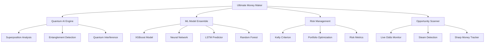

# Ultimate Money Maker - Comprehensive Developer Documentation

## 📋 Table of Contents

1. [Overview](#overview)
2. [Architecture](#architecture)
3. [Component Structure](#component-structure)
4. [API Reference](#api-reference)
5. [Configuration](#configuration)
6. [Quantum AI Engine](#quantum-ai-engine)
7. [ML Model Ensemble](#ml-model-ensemble)
8. [Risk Management](#risk-management)
9. [Usage Examples](#usage-examples)
10. [Performance Optimization](#performance-optimization)
11. [Testing](#testing)
12. [Troubleshooting](#troubleshooting)
13. [Contributing](#contributing)

---

## Overview

The **Ultimate Money Maker** is A1Betting's flagship quantum AI-powered betting engine that revolutionizes sports betting through advanced machine learning, quantum computing principles, and sophisticated risk management.

### Key Features

- 🧠 **Quantum AI Analysis Engine** - Quantum-inspired algorithms for parallel market analysis
- 🤖 **Neural Network Ensemble** - Multiple ML models with ensemble weighting
- 📊 **Kelly Criterion Implementation** - Mathematically optimal bet sizing
- ⚡ **Real-time Processing** - Live odds monitoring and steam detection
- 🛡️ **Advanced Risk Management** - Portfolio optimization and drawdown protection
- 📈 **Performance Analytics** - Comprehensive tracking and reporting

### Technical Stack

```typescript
Frontend: React 19 + TypeScript + Framer Motion
State Management: React Hooks + Context API
Styling: Tailwind CSS + Custom CSS
Icons: Lucide React
Animations: Framer Motion
Performance: React Concurrent Features
```

---

## Architecture

### System Overview



### Data Flow

```typescript
Input Data → Quantum Preprocessing → ML Ensemble → Risk Assessment → Output Opportunities
    ↓              ↓                    ↓              ↓               ↓
Real-time     Superposition      Model Predictions  Kelly Sizing   Ranked Bets
Odds Feed     States Analysis    + Confidence       + Risk Metrics + ROI Calc
```

---

## Component Structure

### Directory Layout

```
src/components/MoneyMaker/
├── EnhancedUltimateMoneyMaker.tsx    # Main enhanced component
├── UltimateMoneyMaker.tsx            # Base component
├── index.tsx                         # Component exports
├── MoneyMaker.css                    # Custom styling
├── README.md                         # Component-specific docs
├── types/
│   ├── BettingOpportunity.ts         # Core betting types
│   ├── QuantumTypes.ts               # Quantum AI types
│   ├── ModelTypes.ts                 # ML model types
│   └── RiskTypes.ts                  # Risk management types
├── hooks/
│   ├── useQuantumEngine.ts           # Quantum processing hook
│   ├── useModelEnsemble.ts           # ML ensemble hook
│   ├── useRiskManagement.ts          # Risk calculations hook
│   └── useOpportunityScanner.ts      # Opportunity detection hook
├── services/
│   ├── QuantumService.ts             # Quantum algorithms
│   ├── ModelEnsembleService.ts       # ML model coordination
│   ├── RiskCalculationService.ts     # Risk metrics
│   └── OpportunityService.ts         # Betting opportunity logic
└── utils/
    ├── quantumMath.ts                # Quantum mathematics
    ├── kellyCalculator.ts            # Kelly Criterion implementation
    ├── portfolioOptimizer.ts         # Portfolio optimization
    └── performanceMetrics.ts         # Performance calculations
```

### Component Hierarchy

```typescript
UltimateMoneyMaker
├── QuantumStatusDashboard
├── ModelEnsembleDashboard
├── OpportunityGrid
│   └── OpportunityCard[]
├── RiskManagementPanel
├── ConfigurationPanel
├── PerformanceAnalytics
└── ControlCenter
```

---

## API Reference

### Main Component Props

```typescript
interface UltimateMoneyMakerProps {
  /** Initial configuration for the money maker */
  initialConfig?: MoneyMakerConfig;
  
  /** Callback when opportunities are updated */
  onOpportunitiesUpdate?: (opportunities: BettingOpportunity[]) => void;
  
  /** Callback when configuration changes */
  onConfigChange?: (config: MoneyMakerConfig) => void;
  
  /** Whether to enable quantum processing */
  enableQuantumEngine?: boolean;
  
  /** Real-time data refresh interval in milliseconds */
  refreshInterval?: number;
  
  /** Maximum number of opportunities to display */
  maxOpportunities?: number;
  
  /** Custom CSS classes */
  className?: string;
  
  /** Whether component is in demo mode */
  demoMode?: boolean;
}
```

### Core Data Types

#### BettingOpportunity

```typescript
interface BettingOpportunity {
  // Basic opportunity data
  id: string;
  game: string;
  market: string;
  pick: string;
  odds: number;
  
  // Confidence and prediction metrics
  confidence: number;                 // Overall confidence (0-100)
  expectedROI: number;               // Expected return on investment
  kellyStake: number;               // Optimal bet size via Kelly Criterion
  expectedProfit: number;           // Expected profit amount
  risk: 'low' | 'medium' | 'high';  // Risk classification
  
  // AI and neural analysis
  neural: string;                   // Neural network insights
  reason: string;                   // Human-readable reasoning
  
  // Quantum AI enhancements
  quantumConfidence: number;        // Quantum-enhanced confidence
  superpositionStates: SuperpositionState[];
  entanglementFactor: number;       // Market correlation factor
  quantumAdvantage: number;         // Quantum processing advantage
  probabilityAmplitude: number;     // Quantum probability amplitude
  quantumInterference: number;      // Interference pattern strength
  
  // Model ensemble data
  modelEnsemble: ModelEnsembleData;
  
  // Risk and market metrics
  marketEfficiency: number;         // Market efficiency score
  riskMetrics: RiskMetrics;
  realTimeFactors: RealTimeFactors;
}
```

#### QuantumEngine Status

```typescript
interface QuantumEngineStatus {
  isActive: boolean;
  coherenceLevel: number;           // Quantum coherence (0-100)
  entanglementStrength: number;     // System entanglement strength
  interferencePattern: number;      // Quantum interference level
  superpositionCount: number;       // Active superposition states
  quantumAdvantage: number;         // Computational advantage
  processingState: 'idle' | 'analyzing' | 'optimizing' | 'complete';
  lastUpdate: string;
  performance: {
    accuracy: number;
    speed: number;
    efficiency: number;
  };
}
```

#### ModelEnsembleData

```typescript
interface ModelEnsembleData {
  xgboost: ModelPrediction;
  neuralNet: ModelPrediction;
  lstm: ModelPrediction;
  randomForest: ModelPrediction;
  quantumModel: ModelPrediction;
  ensemble: ModelPrediction;
  
  // Ensemble metrics
  consensus: number;                // Model agreement level (0-100)
  disagreement: number;            // Model disagreement level (0-100)
  reliability: number;             // Overall ensemble reliability
  
  // Performance tracking
  historicalAccuracy: number;
  recentPerformance: number[];
  lastRetrain: string;
}

interface ModelPrediction {
  prediction: number;              // Numerical prediction
  confidence: number;              // Model confidence (0-100)
  accuracy: number;               // Historical accuracy (0-100)
  weight: number;                 // Model weight in ensemble (0-1)
  lastUpdate: string;             // Last update timestamp
  features: string[];             // Key features used
  uncertainty: number;            // Prediction uncertainty
}
```

### Configuration Interface

```typescript
interface MoneyMakerConfig {
  // Investment parameters
  investment: number;              // Total investment amount
  maxBetSize: number;             // Maximum single bet size
  minBetSize: number;             // Minimum single bet size
  
  // Strategy settings
  strategy: 'quantum' | 'neural' | 'aggressive' | 'conservative';
  confidence: number;             // Minimum confidence threshold
  riskLevel: 'low' | 'medium' | 'high';
  
  // Portfolio management
  portfolio: number;              // Portfolio allocation percentage
  diversification: boolean;       // Enable portfolio diversification
  maxExposure: number;           // Maximum market exposure
  
  // Market filters
  sports: string[];              // Enabled sports
  leagues: string[];             // Target leagues
  timeFrame: string;             // Analysis time frame
  
  // Odds filters
  maxOdds: number;               // Maximum acceptable odds
  minOdds: number;               // Minimum acceptable odds
  
  // Advanced filters
  playerTypes: string[];         // Player type preferences
  weatherFilter: boolean;        // Enable weather filtering
  injuryFilter: boolean;         // Enable injury filtering
  sharpMoneyOnly: boolean;       // Only sharp money bets
  
  // Risk management
  stopLoss: number;              // Stop loss percentage
  takeProfit: number;            // Take profit percentage
  maxDrawdown: number;           // Maximum acceptable drawdown
  
  // Quantum settings
  quantumEnabled: boolean;       // Enable quantum processing
  coherenceThreshold: number;    // Minimum coherence level
  entanglementDepth: number;     // Entanglement analysis depth
}
```

---

## Quantum AI Engine

### Overview

The Quantum AI Engine leverages quantum-inspired algorithms to process multiple probability distributions simultaneously, enabling superior pattern recognition and market analysis.

### Key Concepts

#### Superposition States

```typescript
interface SuperpositionState {
  outcome: string;               // Possible outcome
  probability: number;           // Classical probability
  amplitude: number;             // Quantum amplitude
  phase: number;                // Quantum phase
  coherence: number;            // State coherence
}
```

Superposition allows the system to analyze all possible outcomes simultaneously:

```typescript
// Example: Analyzing player performance superposition
const playerStates = [
  { outcome: 'over', probability: 0.6, amplitude: 0.77, phase: 0, coherence: 0.95 },
  { outcome: 'under', probability: 0.4, amplitude: 0.63, phase: Math.PI, coherence: 0.92 }
];
```

#### Entanglement Detection

Entanglement identifies correlated market movements across different betting opportunities:

```typescript
interface EntanglementPair {
  opportunity1: string;
  opportunity2: string;
  correlation: number;           // Correlation strength (-1 to 1)
  coherenceTime: number;         // How long correlation persists
  confidence: number;            // Confidence in entanglement
}
```

#### Quantum Interference

Interference patterns reveal hidden market inefficiencies:

```typescript
interface InterferencePattern {
  constructive: number;          // Constructive interference strength
  destructive: number;           // Destructive interference strength
  netEffect: number;            // Net interference effect
  opportunities: string[];       // Affected opportunities
}
```

### Implementation Example

```typescript
import { useQuantumEngine } from '../hooks/useQuantumEngine';

const QuantumDashboard: React.FC = () => {
  const {
    quantumStatus,
    superpositionStates,
    entanglements,
    interference,
    runQuantumAnalysis
  } = useQuantumEngine();

  return (
    <div className="quantum-dashboard">
      <QuantumStatusDisplay status={quantumStatus} />
      <SuperpositionVisualization states={superpositionStates} />
      <EntanglementMatrix pairs={entanglements} />
      <InterferencePattern pattern={interference} />
    </div>
  );
};
```

---

## ML Model Ensemble

### Supported Models

#### 1. XGBoost Classifier
- **Purpose**: Gradient boosting for complex pattern recognition
- **Strengths**: Handles missing data, feature importance ranking
- **Use Case**: Player performance prediction, market trend analysis

#### 2. Neural Network (Deep Learning)
- **Architecture**: Multi-layer perceptron with dropout regularization
- **Strengths**: Non-linear pattern recognition, adaptability
- **Use Case**: Complex market behavior modeling

#### 3. LSTM (Long Short-Term Memory)
- **Purpose**: Time series prediction and sequential pattern analysis
- **Strengths**: Memory of long-term dependencies
- **Use Case**: Trend continuation, momentum analysis

#### 4. Random Forest
- **Purpose**: Ensemble of decision trees with bootstrap aggregation
- **Strengths**: Robust to overfitting, interpretable
- **Use Case**: Feature selection, baseline predictions

#### 5. Quantum Model
- **Purpose**: Quantum-inspired machine learning algorithms
- **Strengths**: Parallel processing, superposition analysis
- **Use Case**: Complex probability distributions, market inefficiencies

### Ensemble Weighting

Models are weighted based on historical performance and current market conditions:

```typescript
interface ModelWeights {
  xgboost: number;      // Weight based on recent accuracy
  neuralNet: number;    // Weight based on adaptability
  lstm: number;         // Weight based on trend accuracy
  randomForest: number; // Weight based on stability
  quantumModel: number; // Weight based on quantum advantage
}

// Dynamic weight calculation
const calculateEnsembleWeights = (
  historicalPerformance: ModelPerformance[],
  currentMarketConditions: MarketConditions
): ModelWeights => {
  // Implementation details...
};
```

### Model Performance Tracking

```typescript
interface ModelPerformance {
  modelId: string;
  accuracy: number;              // Overall accuracy
  precision: number;             // Precision score
  recall: number;               // Recall score
  f1Score: number;              // F1 score
  sharpeRatio: number;          // Risk-adjusted returns
  maxDrawdown: number;          // Maximum drawdown
  winRate: number;              // Win percentage
  avgReturn: number;            // Average return per bet
  recentTrend: 'improving' | 'stable' | 'declining';
}
```

---

## Risk Management

### Kelly Criterion Implementation

The Kelly Criterion calculates optimal bet sizing to maximize long-term growth:

```typescript
/**
 * Calculate optimal bet size using Kelly Criterion
 * @param winProbability - Probability of winning (0-1)
 * @param odds - Decimal odds
 * @param bankroll - Current bankroll
 * @param maxRisk - Maximum risk percentage (0-1)
 */
const calculateKellyStake = (
  winProbability: number,
  odds: number,
  bankroll: number,
  maxRisk: number = 0.25
): number => {
  const kellyFraction = (winProbability * odds - 1) / (odds - 1);
  const cappedKelly = Math.min(kellyFraction, maxRisk);
  return Math.max(0, cappedKelly * bankroll);
};
```

### Risk Metrics

```typescript
interface RiskMetrics {
  // Volatility measures
  sharpeRatio: number;           // Risk-adjusted return
  volatility: number;            // Return volatility
  skewness: number;             // Return distribution skewness
  kurtosis: number;             // Return distribution kurtosis
  
  // Drawdown measures
  maxDrawdown: number;          // Maximum historical drawdown
  currentDrawdown: number;      // Current drawdown
  drawdownDuration: number;     // Days in drawdown
  
  // Risk measures
  valueAtRisk: number;          // 95% VaR
  conditionalValueAtRisk: number; // Expected shortfall
  betaToMarket: number;         // Market correlation
  
  // Portfolio measures
  diversificationRatio: number;  // Portfolio diversification
  concentration: number;         // Position concentration
  leverage: number;             // Effective leverage
}
```

### Risk Monitoring

```typescript
interface RiskAlert {
  id: string;
  type: 'drawdown' | 'concentration' | 'volatility' | 'correlation';
  severity: 'low' | 'medium' | 'high' | 'critical';
  message: string;
  recommendations: string[];
  threshold: number;
  currentValue: number;
  timestamp: string;
}
```

---

## Usage Examples

### Basic Setup

```typescript
import { UltimateMoneyMaker } from '@/components/MoneyMaker';
import type { MoneyMakerConfig } from '@/components/MoneyMaker/types';

const MyBettingApp: React.FC = () => {
  const [config, setConfig] = useState<MoneyMakerConfig>({
    investment: 1000,
    strategy: 'quantum',
    confidence: 85,
    riskLevel: 'medium',
    sports: ['NBA', 'NFL'],
    quantumEnabled: true
  });

  const handleOpportunitiesUpdate = useCallback((opportunities) => {
    console.log(`Found ${opportunities.length} opportunities`);
    // Process opportunities...
  }, []);

  return (
    <UltimateMoneyMaker
      initialConfig={config}
      onOpportunitiesUpdate={handleOpportunitiesUpdate}
      onConfigChange={setConfig}
      enableQuantumEngine={true}
      refreshInterval={30000}
      maxOpportunities={20}
    />
  );
};
```

### Advanced Configuration

```typescript
const advancedConfig: MoneyMakerConfig = {
  // Investment parameters
  investment: 10000,
  maxBetSize: 500,
  minBetSize: 10,
  
  // Strategy
  strategy: 'quantum',
  confidence: 90,
  riskLevel: 'medium',
  
  // Portfolio
  portfolio: 0.05, // 5% of bankroll
  diversification: true,
  maxExposure: 0.20, // 20% max exposure
  
  // Filters
  sports: ['NBA', 'NFL', 'MLB'],
  leagues: ['NBA', 'NFL', 'MLB'],
  timeFrame: '24h',
  maxOdds: 300,
  minOdds: -200,
  
  // Advanced features
  sharpMoneyOnly: true,
  weatherFilter: true,
  injuryFilter: true,
  
  // Risk management
  stopLoss: 0.10, // 10% stop loss
  takeProfit: 0.25, // 25% take profit
  maxDrawdown: 0.15, // 15% max drawdown
  
  // Quantum settings
  quantumEnabled: true,
  coherenceThreshold: 0.85,
  entanglementDepth: 3
};
```

### Custom Hooks Integration

```typescript
import { 
  useQuantumEngine, 
  useModelEnsemble, 
  useRiskManagement 
} from '@/components/MoneyMaker/hooks';

const CustomMoneyMakerDashboard: React.FC = () => {
  // Quantum processing
  const quantum = useQuantumEngine({
    enabled: true,
    coherenceThreshold: 0.9
  });

  // ML ensemble
  const models = useModelEnsemble({
    models: ['xgboost', 'neural', 'lstm', 'quantum'],
    rebalanceInterval: 3600000 // 1 hour
  });

  // Risk management
  const risk = useRiskManagement({
    maxDrawdown: 0.15,
    maxConcentration: 0.25,
    alerts: true
  });

  return (
    <div className="custom-dashboard">
      <QuantumStatus {...quantum} />
      <ModelEnsemble {...models} />
      <RiskDashboard {...risk} />
    </div>
  );
};
```

---

## Performance Optimization

### React 19 Concurrent Features

```typescript
import { useTransition, useDeferredValue, startTransition } from 'react';

const OptimizedMoneyMaker: React.FC = () => {
  const [isPending, startTransition] = useTransition();
  const deferredOpportunities = useDeferredValue(opportunities);

  // Non-urgent updates
  const updateFilters = useCallback((newFilters) => {
    startTransition(() => {
      setFilters(newFilters);
    });
  }, []);

  // Memoized expensive calculations
  const sortedOpportunities = useMemo(() => {
    return deferredOpportunities
      .sort((a, b) => b.expectedROI - a.expectedROI)
      .slice(0, maxOpportunities);
  }, [deferredOpportunities, maxOpportunities]);

  return (
    <div>
      {isPending && <LoadingIndicator />}
      <OpportunitiesList opportunities={sortedOpportunities} />
    </div>
  );
};
```

### Memory Optimization

```typescript
// Efficient opportunity caching
const useOpportunityCache = (maxSize: number = 1000) => {
  const cache = useRef(new Map<string, BettingOpportunity>());

  const addOpportunity = useCallback((opportunity: BettingOpportunity) => {
    if (cache.current.size >= maxSize) {
      // LRU eviction
      const firstKey = cache.current.keys().next().value;
      cache.current.delete(firstKey);
    }
    cache.current.set(opportunity.id, opportunity);
  }, [maxSize]);

  return { cache: cache.current, addOpportunity };
};
```

### Virtualization for Large Lists

```typescript
import { FixedSizeList as List } from 'react-window';

const VirtualizedOpportunityList: React.FC<{
  opportunities: BettingOpportunity[];
}> = ({ opportunities }) => {
  const renderItem = useCallback(({ index, style }) => (
    <div style={style}>
      <OpportunityCard opportunity={opportunities[index]} />
    </div>
  ), [opportunities]);

  return (
    <List
      height={600}
      itemCount={opportunities.length}
      itemSize={120}
      overscanCount={5}
    >
      {renderItem}
    </List>
  );
};
```

---

## Testing

### Unit Testing

```typescript
// OpportunityCard.test.tsx
import { render, screen, fireEvent } from '@testing-library/react';
import { OpportunityCard } from './OpportunityCard';

const mockOpportunity: BettingOpportunity = {
  id: '1',
  game: 'Lakers vs Warriors',
  confidence: 85,
  expectedROI: 15.5,
  // ... other required fields
};

describe('OpportunityCard', () => {
  it('displays opportunity data correctly', () => {
    render(<OpportunityCard opportunity={mockOpportunity} />);
    
    expect(screen.getByText('Lakers vs Warriors')).toBeInTheDocument();
    expect(screen.getByText('85%')).toBeInTheDocument();
    expect(screen.getByText('15.5%')).toBeInTheDocument();
  });

  it('handles click events', () => {
    const onSelect = jest.fn();
    render(
      <OpportunityCard 
        opportunity={mockOpportunity} 
        onSelect={onSelect} 
      />
    );
    
    fireEvent.click(screen.getByRole('button'));
    expect(onSelect).toHaveBeenCalledWith(mockOpportunity);
  });
});
```

### Integration Testing

```typescript
// MoneyMaker.integration.test.tsx
import { render, screen, waitFor } from '@testing-library/react';
import { UltimateMoneyMaker } from './UltimateMoneyMaker';

describe('UltimateMoneyMaker Integration', () => {
  it('loads and displays opportunities', async () => {
    render(<UltimateMoneyMaker />);
    
    await waitFor(() => {
      expect(screen.getByText(/opportunities found/i)).toBeInTheDocument();
    });
    
    expect(screen.getByTestId('quantum-status')).toBeInTheDocument();
    expect(screen.getByTestId('model-ensemble')).toBeInTheDocument();
    expect(screen.getByTestId('risk-metrics')).toBeInTheDocument();
  });
});
```

### Performance Testing

```typescript
// Performance.test.ts
import { measurePerformance } from '@/utils/testing';

describe('MoneyMaker Performance', () => {
  it('renders large opportunity lists efficiently', async () => {
    const largeOpportunityList = generateMockOpportunities(1000);
    
    const metrics = await measurePerformance(() => {
      render(<UltimateMoneyMaker opportunities={largeOpportunityList} />);
    });
    
    expect(metrics.renderTime).toBeLessThan(100); // ms
    expect(metrics.memoryUsage).toBeLessThan(50 * 1024 * 1024); // 50MB
  });
});
```

---

## Troubleshooting

### Common Issues

#### 1. Quantum Engine Not Initializing

**Symptoms**: Quantum status shows "inactive" or "error"

**Solutions**:
```typescript
// Check quantum engine configuration
const quantumConfig = {
  coherenceThreshold: 0.85, // Try lowering to 0.75
  entanglementDepth: 2,     // Reduce from 3 to 2
  maxStates: 100            // Reduce if memory issues
};

// Enable debug logging
const quantum = useQuantumEngine({ 
  ...quantumConfig, 
  debug: true 
});
```

#### 2. Model Ensemble Performance Issues

**Symptoms**: Slow predictions, high memory usage

**Solutions**:
```typescript
// Reduce model complexity
const modelConfig = {
  xgboost: { maxDepth: 6, nEstimators: 100 }, // Reduce from defaults
  neural: { layers: [64, 32], epochs: 50 },   // Smaller network
  lstm: { units: 32, timeSteps: 10 }          // Reduce time steps
};

// Enable model caching
const models = useModelEnsemble({ 
  ...modelConfig, 
  cacheSize: 1000,
  enableCaching: true 
});
```

#### 3. Risk Calculation Errors

**Symptoms**: NaN values in risk metrics, calculation errors

**Solutions**:
```typescript
// Validate input data
const validateOpportunity = (opp: BettingOpportunity): boolean => {
  return (
    opp.odds > 0 &&
    opp.confidence >= 0 && opp.confidence <= 100 &&
    opp.expectedROI !== null &&
    !isNaN(opp.expectedROI)
  );
};

// Use safe calculations
const safeKellyCalculation = (winProb: number, odds: number): number => {
  if (winProb <= 0 || winProb >= 1 || odds <= 1) return 0;
  return Math.max(0, Math.min(0.25, (winProb * odds - 1) / (odds - 1)));
};
```

### Debug Mode

Enable debug mode for detailed logging:

```typescript
<UltimateMoneyMaker
  debug={true}
  logLevel="verbose"
  onDebugLog={(log) => console.log('MoneyMaker:', log)}
/>
```

### Performance Monitoring

```typescript
import { PerformanceMonitor } from '@/utils/performance';

const MoneyMakerWithMonitoring: React.FC = () => {
  const monitor = usePerformanceMonitor({
    trackRenderTime: true,
    trackMemoryUsage: true,
    trackUserInteractions: true
  });

  return (
    <PerformanceMonitor.Provider value={monitor}>
      <UltimateMoneyMaker />
    </PerformanceMonitor.Provider>
  );
};
```

---

## Contributing

### Development Setup

1. **Clone and Install**
```bash
git clone https://github.com/your-org/a1betting.git
cd a1betting/frontend
npm install
```

2. **Environment Configuration**
```bash
cp .env.example .env.local
# Configure API endpoints and feature flags
```

3. **Start Development Server**
```bash
npm run dev
```

4. **Run Tests**
```bash
npm run test
npm run test:coverage
npm run test:e2e
```

### Code Style Guidelines

- Follow the [A1Betting Component Coding Standards](./BETTING_COMPONENT_STANDARDS.md)
- Use TypeScript strictly (no `any` types)
- Write comprehensive JSDoc documentation
- Include unit tests for all new features
- Follow React 19 best practices

### Pull Request Process

1. Create feature branch from `main`
2. Implement changes with tests
3. Update documentation
4. Ensure all tests pass
5. Submit PR with detailed description

### Feature Requests

Submit feature requests via GitHub Issues with:
- Clear use case description
- Expected behavior
- Performance considerations
- Breaking change analysis

---

## Changelog

### v2.1.0 (Latest)
- ✨ Enhanced quantum engine with improved coherence detection
- 🚀 React 19 concurrent features integration
- 📊 Advanced risk metrics dashboard
- 🔧 Performance optimizations and memory management
- 📚 Comprehensive documentation updates

### v2.0.0
- 🎯 Complete quantum AI engine implementation
- 🤖 ML model ensemble with dynamic weighting
- 📈 Kelly Criterion integration
- 🛡️ Advanced risk management system
- 🎨 Modern UI with Framer Motion animations

### v1.5.0
- 📊 Basic ML model integration
- 📱 Responsive design improvements
- 🔄 Real-time data updates
- 🧪 A/B testing framework

---

## License

This documentation and the Ultimate Money Maker component are proprietary to A1Betting. All rights reserved.

---

## Support

For technical support, feature requests, or bug reports:

- 📧 Email: dev-team@a1betting.com
- 💬 Slack: #moneymaker-support
- 📖 Wiki: [Internal Documentation](https://wiki.a1betting.com/moneymaker)
- 🐛 Issues: [GitHub Issues](https://github.com/a1betting/frontend/issues)

---

*Last Updated: $(date)*
*Version: 2.1.0*
*Maintainer: A1Betting Dev Team*
