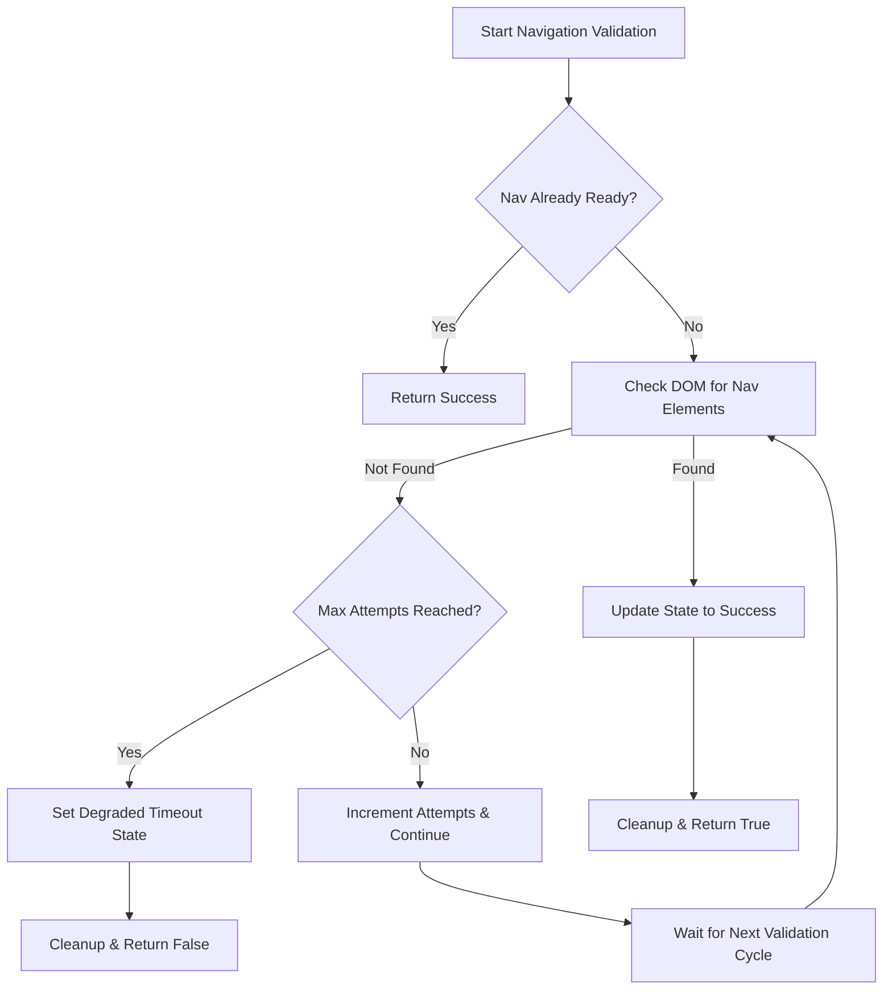

# Navigation Validator Optimization Documentation

## Overview

This document describes the implementation of the optimized navigation validation system that resolves persistent Navigation readiness failures and optimizes validator timing without regressing recent WebSocket and health fixes.

## Problem Statement

The previous navigation validation system had several issues:
- **Infinite Polling**: Used continuous MutationObserver polling creating noisy `[NavDiag]` logs
- **Race Conditions**: Validator could start before navigation components mounted
- **Missing Attributes**: Navigation component lacked proper semantic markup (`role="navigation"`, `data-testid="primary-nav"`)
- **False Positives**: Selector mismatches caused unnecessary degraded states

## Solution Architecture

### 1. Event-Driven Navigation Ready Signal

**File**: `frontend/src/navigation/navReadySignal.ts`

A lightweight event system that coordinates navigation readiness:

```typescript
// Signal that navigation is ready
signalNavReady(): void

// Subscribe to navigation ready events
onNavReady(callback: () => void): () => void

// Check if navigation is already ready
isNavReady(): boolean
```

**Benefits**:
- Eliminates continuous polling
- Provides deterministic readiness detection
- Supports immediate callback for already-ready state

### 2. Enhanced Navigation Component

**File**: `frontend/src/components/navigation/EnhancedNavigation.tsx`

Updated with required semantic attributes and signal integration:

```tsx
<nav role="navigation" data-testid="primary-nav">
  {/* Navigation content */}
</nav>
```

**Changes**:
- Added `role="navigation"` for semantic markup
- Added `data-testid="primary-nav"` for reliable testing
- Integrated `signalNavReady()` call in `useEffect` on mount

### 3. State Machine Navigation Validator

**File**: `frontend/src/services/coreFunctionalityValidator.ts`

Refactored navigation validation with state machine approach:

```typescript
interface CoreValidatorConfig {
  navMaxAttempts: number;      // Default: 12
  navIntervalMs: number;       // Default: 250ms
  enableDev: boolean;          // Development logging
}

// State machine states
type NavValidationState = 'idle' | 'waitingForDom' | 'success' | 'degraded_timeout';
```

**Key Features**:
- **Bounded Attempts**: Maximum 12 attempts (configurable)
- **Event Integration**: Uses navReady signal for short-circuiting
- **Quiet Mode**: Single diagnostic log per validation cycle
- **Hardened Selectors**: `'[data-testid="primary-nav"], [role="navigation"], nav'`
- **Automatic Cleanup**: Proper resource cleanup on success/timeout

## Configuration Options

Environment variables for runtime control:

```bash
# Maximum validation attempts (default: 12)
VITE_VALIDATOR_NAV_MAX_ATTEMPTS=12

# Interval between attempts in milliseconds (default: 250)
VITE_VALIDATOR_NAV_INTERVAL_MS=250
```

## Implementation Details

### Navigation Validation Flow



### State Machine Implementation

```typescript
private async validateNavigation(): Promise<boolean> {
  const config = this.getConfig();
  
  // Short-circuit if navigation already ready
  if (isNavReady()) {
    this.navValidationState = 'success';
    return true;
  }
  
  // Set up event listener if first attempt
  if (!this.navReadyUnsubscribe && this.navValidationAttempts === 0) {
    this.navReadyUnsubscribe = onNavReady(() => {
      this.navValidationState = 'success';
    });
  }
  
  // Increment attempts and check DOM
  this.navValidationAttempts++;
  
  const navElements = document.querySelectorAll(
    '[data-testid="primary-nav"], [role="navigation"], nav'
  );
  
  if (navElements.length > 0) {
    this.navValidationState = 'success';
    this.cleanupNavValidation();
    return true;
  }
  
  // Check timeout condition
  if (this.navValidationAttempts >= config.navMaxAttempts) {
    this.navValidationState = 'degraded_timeout';
    this.cleanupNavValidation();
    return false;
  }
  
  return false; // Continue validation
}
```

### Resource Cleanup

```typescript
private cleanupNavValidation(): void {
  if (this.navReadyUnsubscribe) {
    this.navReadyUnsubscribe();
    this.navReadyUnsubscribe = undefined;
  }
  if (this.navValidationTimeout) {
    clearTimeout(this.navValidationTimeout);
    this.navValidationTimeout = null;
  }
  this.navValidationState = 'idle';
  this.navValidationAttempts = 0;
}
```

## Testing Strategy

**Test File**: `frontend/src/services/tests/navigationValidator.test.ts`

### Test Categories

1. **Success Scenarios**
   - Navigation already ready via signal
   - Navigation elements found in DOM
   - Hardened selector validation

2. **Delayed Navigation**
   - Component mounting after validator starts
   - Event-driven readiness detection

3. **Degraded Timeout**
   - Maximum attempts reached
   - Proper state cleanup on timeout
   - Attempt counter validation

4. **Configuration Overrides**
   - Custom max attempts from environment
   - Fallback to defaults for invalid values

5. **Quiet Mode**
   - Production mode log suppression
   - Single diagnostic per cycle

6. **Resource Management**
   - Cleanup on validation stop
   - Event unsubscription
   - Timeout clearing

### Running Tests

```bash
cd frontend
npm run test navigationValidator.test.ts
```

## Performance Improvements

### Before Optimization
- **Continuous Polling**: MutationObserver running indefinitely
- **Noisy Logging**: Multiple `[NavDiag]` logs per validation cycle
- **Resource Leaks**: No proper cleanup of observers/timeouts
- **Race Conditions**: Validator starts before components ready

### After Optimization
- **Event-Driven**: Deterministic readiness detection
- **Quiet Mode**: Single diagnostic log per cycle
- **Bounded Attempts**: Maximum 12 attempts (3 seconds at 250ms intervals)
- **Resource Cleanup**: Proper cleanup of all resources
- **Configuration**: Runtime control via environment variables

## Integration Points

### Health System Integration

The navigation validator integrates with existing health monitoring:

```typescript
// Part of overall system health validation
const validationResults = {
  navigation: await this.validateNavigation(),
  dataFetching: await this.validateDataFetching(),
  userInteractions: await this.validateUserInteractions(),
  // ... other validations
};
```

### WebSocket Compatibility

The optimization maintains compatibility with recent WebSocket fixes:
- No interference with WebSocket error handling
- Preserves graceful degradation patterns
- Maintains error handling isolation

## Debugging

### Development Mode Logging

When `NODE_ENV === 'development'`:

```
[NavDiag] Navigation already ready
[NavDiag] Starting navigation validation...
[NavDiag] Navigation validation successful - found elements: 1
[NavDiag] Navigation validation degraded - no nav elements found after 12 attempts
```

### Production Mode

In production, navigation validation runs silently with no console output.

### Environment Configuration

Check current configuration:

```javascript
// In browser console
console.log('Nav Max Attempts:', import.meta.env.VITE_VALIDATOR_NAV_MAX_ATTEMPTS);
console.log('Nav Interval:', import.meta.env.VITE_VALIDATOR_NAV_INTERVAL_MS);
```

## Troubleshooting

### Common Issues

1. **Navigation Still Fails**: Verify navigation component has `role="navigation"` and `data-testid="primary-nav"`
2. **Event Not Firing**: Check that `signalNavReady()` is called in navigation component's `useEffect`
3. **Timeout Too Quick**: Increase `VITE_VALIDATOR_NAV_MAX_ATTEMPTS` environment variable
4. **Too Many Logs**: Ensure `NODE_ENV=production` for deployed environments

### Debug Checklist

- [ ] Navigation component has required attributes
- [ ] `signalNavReady()` called on component mount
- [ ] Environment variables properly set
- [ ] No console errors from navigation components
- [ ] Tests passing for navigation validator

## Future Enhancements

1. **Health Integration**: Add navigation status to health endpoint diagnostics
2. **Metrics Collection**: Track validation success/failure rates
3. **Adaptive Timing**: Adjust intervals based on historical success patterns
4. **Component Registry**: Register multiple navigation components for complex layouts

## Conclusion

The navigation validator optimization provides:
- **Reliability**: Event-driven validation eliminates race conditions
- **Performance**: Bounded attempts with proper cleanup
- **Maintainability**: Clear state machine with comprehensive tests
- **Configurability**: Runtime control via environment variables
- **Compatibility**: Preserves existing WebSocket and health fixes

This implementation resolves the persistent Navigation readiness failures while optimizing validator timing and maintaining system reliability.